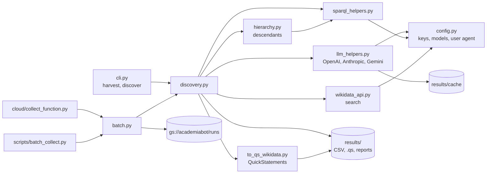
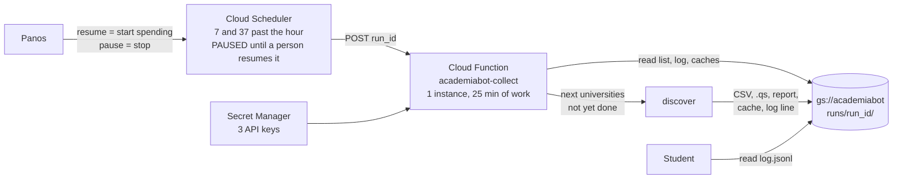

# AGENTS.md

Instructions for AI coding agents working in this repo. `CLAUDE.md` imports this file.

## Project

**AcademiaBot** populates Wikidata with the full organizational hierarchy of universities worldwide (university > college/school > department > program) and connects faculty/researcher entities to their departments. We use LLMs for entity discovery, disambiguation, and matching, and the Wikidata API + SPARQL for reads/writes.

## Repository layout

```
academiabot/
├── wikidata_discover/           # Main package
│   ├── cli.py                   # argparse CLI: "harvest" and "discover" commands
│   ├── config.py                # Env vars, constants (OPENAI_API_KEY, LLM_MODEL, SPARQL_ENDPOINT)
│   ├── discovery.py             # Core Discovery class: orchestrates LLM + SPARQL + matching
│   ├── harvester.py             # SPARQL harvest of all U.S. universities to JSON
│   ├── hierarchy.py             # BFS crawler over P527/P355/P199/P361/P749
│   ├── llm_helpers.py           # LLMHelper: per-provider extract_divisions_*, ensemble, judge_union, choose_match
│   ├── sparql_helpers.py        # Thin wrapper around SPARQLWrapper
│   ├── wikidata_api.py          # wbsearchentities wrapper
│   ├── to_qs_wikidata.py        # Export missing entities as QuickStatements
│   ├── batch.py                 # Resumable batch over many QIDs; uploads every artifact to the bucket
│   ├── cloud/collect_function.py # Cloud Function (gen 2) entry point: one time slice of a run, on a schedule
│   ├── requirements.txt
│   ├── eval/                    # Ground truth for 12 universities + run_eval.py harness
│   ├── results/                 # Output CSVs, universities_us.json, LLM cache
│   └── scripts/
│       ├── wikidata_division_discover.py   # Entrypoint
│       └── batch_collect.py                # CLI wrapper around batch.py
├── deploy/                      # deploy_collect_function.sh: Cloud Function + paused half-hourly Scheduler job
├── docs/                        # BACKGROUND.md (origins, decisions), LITERATURE.md (research behind the plan);
│                                #   later MODELING_RULES.md, REVIEW_GUIDE.md, REVIEW_PROTOCOL.md
├── tests/                       # pytest unit tests (fuzzy matching)
└── misc_scripts/                # Legacy hierarchy scripts (deprecated, not imported)
```



## How to run

```bash
pip install -r wikidata_discover/requirements.txt -r wikidata_discover/cloud/requirements.txt pytest
# Copy env.example to .env and set at least one provider key (OPENAI_API_KEY preferred; all three for the eval harness)
python -m wikidata_discover.scripts.wikidata_division_discover harvest
python -m wikidata_discover.scripts.wikidata_division_discover discover Q49210  # NYU
python -m wikidata_discover.eval.run_eval      # precision/recall against ground truth
python -m pytest tests -q
```

## Tech stack

- Python 3.11+
- Three LLM providers with structured JSON output: OpenAI Responses API (with `web_search_preview`),
  Anthropic Messages API and Google Gemini (`google-genai`), both currently without web search or grounding
- SPARQLWrapper for Wikidata SPARQL endpoint
- rapidfuzz for fuzzy name matching
- pandas for CSV I/O
- rich for console output

## Key Wikidata properties

| Property | Meaning | Usage |
|----------|---------|-------|
| P31 | instance of | Classify entities (Q3918=university, Q1183543=academic dept) |
| P279 | subclass of | Type hierarchy |
| P749 | parent organization | **Primary relationship**: school -> university, dept -> school |
| P361 | part of | Alternative/supplementary upward link |
| P527 | has part | Downward: university -> schools |
| P355 | has subsidiary | Downward: org -> sub-org |
| P199 | business division | Downward: org -> division |
| P856 | official website | QA and verification |
| P1771 | IPEDS ID | U.S. institution identifier |
| P108 | employer | Researcher -> institution |
| P39 | position held | Faculty role |
| P101 | field of work | Department/researcher discipline |
| P3418 | academic discipline | More specific than P101 |
| P1960 | Google Scholar author ID | Researcher profile link |
| P496 | ORCID iD | Researcher identifier |
| P6782 | ROR ID | Research Organization Registry identifier for institutions |
| P571 | inception | When a unit was founded (optional) |

## Data model (target hierarchy)

```
University (Q3918)
  └─ P749 ─ College/School (Q31855 or Q3918)
       └─ P749 ─ Department (Q1183543 / Q2467461)
            └─ P749 ─ Program / Lab / Center (Q1664727 / Q4830453)
                 └─ P108 ─ Faculty/Researcher
```

Use **P749 (parent organization)** as the primary relationship. Add P361 as supplementary only. For dual-parent units (joint departments), add a second P749 with rank=normal and qualifiers.

Minimum statement set for any new item: label, English description, P31, P749, P17, and P856 if known. Universities also get P1771. One QuickStatements file per hierarchy level. Reasoning for these choices is in `docs/BACKGROUND.md`.

## Current pipeline

1. `harvest`: SPARQL fetches all U.S. universities (P31/P279 -> Q3918, P17 -> Q30)
2. `discover <QID>`: For a given university:
   a. Fetch university label + website from Wikidata
   b. `extract_divisions_best_available()` tries OpenAI, then Anthropic, then Gemini, and returns the
      first non-empty result. Only OpenAI has web search. The ensemble + judge is NOT used here yet.
   c. (eval only) `extract_divisions_ensemble()` runs two generators and `judge_union()`; see known issue 9
   d. For each candidate: fuzzy-match against existing Wikidata children (rapidfuzz)
   e. Unmatched candidates go to LLM `choose_match` for disambiguation
   f. Results classified as: exists_linked, exists_orphan, missing, or unresolved (Wikidata could not be
      checked for that candidate, or no LLM could judge the match; it is listed in the JSON report as
      `unresolved_candidates` and never written to the CSV or QuickStatements file)
   g. Results exported to CSV + QuickStatements: missing entities as CREATE blocks, orphans as a single
      statement linking the existing QID to the university

## LLM integration details

- `extract_divisions_openai/anthropic/gemini()`: one per provider, same output shape. Only the OpenAI call
  enables a web search tool; the other two answer from model knowledge, so their cited URLs are unverified
- `extract_divisions_best_available()`: first-success fallback (OpenAI, then Anthropic, then Gemini). This is
  what `discover` calls. It does not run all providers and does not call the judge
- `extract_divisions_ensemble()`: OpenAI + Anthropic generate, Gemini judges. Used by the eval harness only
- `judge_union()`: one provider reviews the union of all candidates and keeps only real units
- `choose_match()`: single-token classification (QID / ORPHAN:QID / NONE)
- Responses are cached in `results/cache/`, keyed by (university, provider, model, prompt hash).
  Match decisions are also keyed by which providers are configured, and a cached decision
  made by a fallback provider is asked again once the preferred provider answers
- Models configured in `config.py`: `LLM_MODEL` (OpenAI), `ANTHROPIC_MODEL`, `GEMINI_MODEL`; all overridable in `.env`
- Eval on 12 universities: best config is Anthropic judge over OpenAI + Gemini, about 0.95 precision and recall
  (see `eval/results_summary.csv`)

## Working norms (read first)

Students on this project direct agents; they do not write most of the code. There are two
students with two tracks in `TASKS.md`: Anya builds the hierarchy, aligned with Wikidata and with
evidence for every unit (section 5); Shuo checks it with other LLMs, the evidence, and people
(section 6). Each also owns two research questions (section 8), and the measurements they need
are part of the weekly tasks. So:

- Work on exactly the track and week in `TASKS.md` that the student names. Do not start the next one.
- The "you check it by" cell for that week is the acceptance test. Make it pass and show it passing.
- Before writing code, give a short plan (five lines or fewer) and wait for a go-ahead.
- Explain what you did in plain language. Assume the reader can run a command and open a CSV but will not read a diff.
- Run `python -m pytest tests -q` before saying anything is done. Add a test for every behavior you add.
- At the end of a session: tick the boxes you completed in `TASKS.md`, add anything a future agent needs to this file, and leave the student a three-line summary.
- Never upload to Wikidata, never run QuickStatements batches, never write to the Wikidata API. Humans do that step.
- Never commit `.env` or any API key.
- One milestone per branch and pull request.

## Coding conventions

- All SPARQL goes through `sparql_helpers.py` (never construct SPARQLWrapper directly)
- All LLM calls go through `LLMHelper` static methods in `llm_helpers.py`
- Use `config.console` (rich Console) for user-facing output
- Keep 0.3s sleep between SPARQL requests (polite crawling)
- Output files go to `wikidata_discover/results/`
- Never use em-dashes in code comments, docstrings, or output strings
- Write functions that are independently testable (separate logic from I/O)
- For new LLM prompts, follow the pattern in `llm_helpers.py` (structured JSON schema)

## Writing style (about 80% ASD-STE100)

Write prose for people in a style close to ASD-STE100 Simplified Technical English. This
applies to `TASKS.md`, files in `docs/`, guides for the students, pull request descriptions,
session summaries, reports, and user-facing output strings. It does not apply to code,
identifiers, or quoted data. The readers are business undergraduates with little technical
background.

Follow these STE rules:

- Keep sentences short: 20 words or fewer in an instruction, 25 or fewer in a description.
- Write one instruction per sentence. Use the imperative: "Run the tests." Not "You should run the tests."
- Use the active voice. Use the passive only when the actor is unknown or not important.
- Keep one topic per paragraph, and 6 sentences or fewer per paragraph.
- Use one word for one meaning. Use the same term for the same thing in all files (the
  glossary in `TASKS.md` section 12 is the reference). Do not change words for variety.
- Use simple tenses: present, past, future. Do not use "-ing" words as verbs.
- Prefer a single verb to a phrasal verb: "start", not "kick off"; "find", not "figure out".
- Keep "a", "an" and "the". Do not write in telegraphic style.
- Use numbered lists for steps in sequence and bullets for parallel items.
- Put a warning before the step it applies to, not after.
- Be specific: give the number, the file, the command. Do not use vague words such as
  "some", "various", "appropriate", or "as needed".

The other 20% (where we relax STE):

- You do not have to use the STE approved dictionary. Common words are fine when they have
  one clear meaning in context.
- Technical names are allowed: Wikidata, QID, P749, BigQuery, precision, recall. Define each
  one on first use or point to the glossary.
- A sentence that explains *why* (not an instruction) may use "because", "if", or "would",
  within the 25-word limit.
- A short analogy is allowed when it makes an idea clear to a non-technical reader.

Also: no em-dashes, and no filler phrases such as "honest", "load-bearing", "it's not X,
it's Y", "dive into", or "robust".

## Known issues

1. ~~`config.py` hardcodes `LLM_MODEL = "gpt-5"` but README says "gpt-4o"~~ Fixed: reads from `.env` with default `gpt-4o`
2. ~~`misc_scripts/hierarchy.py` uses broken relative imports~~ Fixed: scripts are standalone; deprecated in favor of `wikidata_discover.hierarchy`
3. ~~No rate limiting on `wikidata_api.quick_wd_search()`~~ Fixed: 0.3s delay added
4. ~~No retry/backoff on API failures~~ Fixed: tenacity exponential backoff on SPARQL and Wikidata API
5. ~~`to_qs_wikidata.py` caps at 10 items (`missing[:10]`) with no config~~ Fixed: configurable `max_items` param, defaults to all
6. ~~CLI `--llm` override is broken~~ Fixed twice: `cli.py` now sets `config.LLM_MODEL`, and `llm_helpers.py`
   reads model names from `config` at call time instead of capturing them at import
7. ~~No tests exist~~ Fixed: `tests/test_fuzzy.py` covers `normalize_name` and `is_fuzzy_match`
8. Discovery only goes one level deep (schools). Departments are the current work; see TASKS.md
9. `discover` uses `extract_divisions_best_available()` (first provider that answers), not the ensemble that
   scored best in eval. Wiring the ensemble into `discover` is Anya's week 8 (TASKS.md)
10. Web search is enabled only for OpenAI. Anthropic and Gemini extraction has no search or grounding tool.
    Fix is Anya's week 4 (TASKS.md)
11. `to_qs_wikidata.py` links new items to the university with P361, but the data model says P749 is primary.
    Fix when the exporter is reworked in Anya's week 9 (TASKS.md)
12. ~~`choose_match()` could never return an orphan: it compared the whole `ORPHAN:QID` token to bare QIDs~~
    Fixed: `parse_match_answer()` handles QID, ORPHAN:QID, and NONE, with tests
13. ~~Every Gemini call failed with `Part.from_text() takes 1 positional argument`: the code used an
    old `google-genai` signature~~ Fixed: `Part.from_text(text=...)` and `config=GenerateContentConfig(...)`.
    Gemini had silently never worked as a fallback or judge
14. Alignment searches with `wbsearchentities`, which matches label prefixes only. It misses items
    whose label starts with the university's name ("Boston University Wheelock College ..." for
    "Wheelock College ..."). A spot check of 40 "missing" schools in `us-tier1` found at least 5
    that already exist. Fix is Anya's week 6 (full-text search, website, parent). Until then,
    treat "missing" as "not found by prefix search"
15. Extraction proposes non-academic units (career services, student affairs) and campuses as
    schools. About 10 of the 40 spot-checked "missing" rows. `docs/MODELING_RULES.md` (week 4)
    decides how each is handled

## Cloud Credentials

- **Provider:** GCP
- **Project:** `wikidata-academia`
- **Service account:** `claude-agent@wikidata-academia.iam.gserviceaccount.com`
- **Roles granted:**
  - `roles/bigquery.dataEditor` -- read/write collected data in BigQuery
  - `roles/bigquery.jobUser` -- run BigQuery queries
  - `roles/storage.objectAdmin` -- read/write data files in GCS buckets
  - `roles/logging.viewer` -- view logs for debugging
  - `roles/cloudfunctions.developer` -- deploy Cloud Functions for data collection
  - `roles/cloudscheduler.admin` -- schedule recurring data collection jobs
  - `roles/iam.serviceAccountUser` -- required for deploying Cloud Functions as the service account
  - `roles/secretmanager.secretAccessor` -- securely access API keys
  - `roles/secretmanager.admin` -- create and manage secrets in Secret Manager
  - `roles/aiplatform.user` -- use Vertex AI / Gemini for entity discovery and judging
  - `roles/run.developer` -- deploy Cloud Run services for long-running tasks
  - `roles/pubsub.editor` -- event-driven pipelines between collection, verification, and writing stages
  - `roles/cloudfunctions.invoker` -- allow scheduler and other functions to trigger Cloud Functions
    (gen 1). The gen 2 function is invoked through `roles/run.developer`, which includes
    `run.routes.invoke`; the deploy script checks this with a real OIDC call after every deploy
- **Multi-user setup:** Each team member has their own `.cloud-credentials.<email>.enc` file, encrypted with their personal passphrase
- **Authentication:** Handled automatically via the `cloud-bootstrap` skill and SessionStart hook (`.claude/hooks/cloud-auth.sh`). The hook matches the credentials file to `git config user.email`, so that must be set to the team member's email.
- **Cross-project access:** The service account also has READER on dataset `nyu-datasets.academiabot` (granted 2026-10-02). See "BigQuery access" below.
- **New team members:** The agent handles onboarding via the cloud-bootstrap "Add Team Member" flow
- **Permission escalation:** Ask the agent to escalate; it will propose roles and ask you to approve via `gcloud`

## Run log (planned, Anya week 2)

Every run must be reproducible. Anya's week 2 creates the first four tables below in dataset
`academiabot` of project `wikidata-academia`, with large text in Cloud Storage and the GCS path
kept in the row. The other three come later and are specified here so both tracks build to the
same shape: `nodes` (Anya, week 5), `checks` (Shuo, week 3), `reviews` (Shuo, week 7).

| Table | One row per | Must contain |
|---|---|---|
| `runs` | command invocation | run_id, invocation_id (a resumable cloud run keeps one run_id across many scheduled invocations, so each invocation has its own id and row), who, git commit, the exact command and arguments (subcommand, QIDs, flags), config (providers, models, depth), start and end time, outcome |
| `llm_calls` | API call | llm_call_id, run_id, invocation_id, provider, model, purpose (extract, judge, match, verify), the request configuration (tools such as web search or grounding, extraction mode, sample number), the cache key, prompt hash, GCS paths to the full prompt and the raw response, tokens, latency, cache hit |
| `evidence` | web page fetched | evidence_id, run_id, invocation_id, url, fetched_at, http_status, content hash, GCS path to the snapshot, unit names found on the page |
| `candidates` | unit proposed | candidate_id, run_id, invocation_id, parent_qid (or parent_candidate_id when the parent has no QID), name, unit_type, status (linked, orphan, missing, unresolved), matched_qid, source_url, provider, llm_call_ids, evidence_ids |
| `nodes` | unit in a hierarchy file | the fields of the hierarchy file below, plus run_id and invocation_id |
| `checks` | one automated check of one unit, or of one of its parent links | check_id, run_id, invocation_id, node_id or candidate_id, parent_id (the parent link checked, as in `reviews`; empty for a check on the whole unit), node_version it evaluated (a check on an older version never counts toward the current confidence), kind (agreement, judge, page_status, name_on_page, verifier), result (pass, fail, unclear), score, detail (for example the quoted sentence or the providers that agreed), llm_call_ids and evidence_ids (every call and page the check used: an agreement check lists the call of each provider and sample it counted), checked_at |
| `reviews` | one reviewer's verdict on one unit, or on one of its parent links | review_id, node_id or candidate_id, parent_id (the parent link judged, for a Prolific item or any verdict on one link; empty for a verdict on the whole unit), run_id and node_version of what was shown (or the candidate's evidence content hash), shown_hash (hash of the whole review row as displayed, checks and confidence included), reviewer, source (expert, prolific), pass or arm (blind: checks hidden; shown: checks visible), verdict (accept, reject, fix), corrections (field to corrected value, for any value the export writes, including each parent link's target, rank, qualifiers, and source), url_checked (one yes/no per evidence page shown), notes, reviewed_at |

Every table has its own stable id so that the `llm_call_ids` and `evidence_ids` of a candidate
or a check resolve to exact rows. `llm_calls`, `evidence`, `candidates`, `nodes`, and `checks`
rows carry the invocation_id as well as the run_id, so each row leads to the exact invocation,
arguments, and time that produced it. Reviews are append-only: a second reviewer adds a row, never
overwrites one, so agreement between reviewers can be computed. Checks are append-only too. The
export honors the reviews a protocol says it should (for example, two accepts and no reject),
and only reviews whose node_version equals the node's current version: node ids are reused
across runs, so a verdict on an earlier version (different name, parent, QID, alignment, or
evidence) never authorizes the new one. A verdict judges the facts and their evidence, so
node_version deliberately leaves out the machine checks: rerunning a verifier does not void a
person's verdict, and shown_hash records what that person saw. Only blind verdicts (checks
hidden) enter precision estimates and the evaluation of confidence scores.

The exporter writes a manifest next to each QuickStatements file: one line per statement with
node_id, node_version, and the review ids that authorize it, plus every in-scope node of that
level that was left out and why. The pre-upload check validates file, manifest, hierarchy,
and reviews together, so a statement without a current verdict, or a node silently dropped,
is caught.

### Hierarchy file (planned, Anya week 5)

One JSON file per university and run, at `results/hierarchy/<QID>.json` and in the bucket
under the run folder. It is the contract between the two tracks: Anya's code writes it,
Shuo's checks and review sheet read it, the exporter turns the reviewed part into
QuickStatements. Each node:

| Field | Meaning |
|---|---|
| node_id | Our own stable id, assigned once when a unit is first seen and never derived from fields that can change. A per-university id register in the bucket (`gs://academiabot/hierarchy/<QID>/ids.json`, kept outside the run folders with the cross-register file below; see "Running collection in the cloud") maps each id to the QID, names, parents, normalized website, and source URLs last seen (the matching rules below need them after the run that saw them is gone); a later run reuses an id when the unit matches (same QID, else same normalized name or alias under the same parent, else an alignment merge). A name match under the same parent counts only when it is unique on both sides: one register entry and one unit in this run with that name there. When a parent has two units with the same name (two "Graduate Program" units under one school), each is matched by its source URL or website, and a unit that still fits more than one entry, or none uniquely, gets a new id and is flagged for a person. A unit without a QID that moves to another parent is matched under the university only when the name or alias and the website or source URL both match, and exactly one register entry fits. A name-only match under another parent is not a move (two schools can each have a "Department of Economics", and an LLM can drop one and name the other): the unit gets a new id and the possible old id is flagged for a person, as when several entries fit. Ids are never guessed. A unit without a QID that was renamed and no longer carries its old name is matched by the same source URL or website under the same parent, again only when exactly one entry fits; otherwise the same flag. A unit that becomes aligned, is renamed, or moves to another parent keeps its id. When two nodes merge, the register records old id -> surviving id, so checks and reviews on the old id still resolve. A unit run jointly by two universities (the Coulter Department of Biomedical Engineering belongs to Georgia Tech and Emory) is kept in one register only. Before any export, a check across all registers looks for the same unit in two universities. The same QID is the same unit: the register that recorded it first owns it. Without a QID, a shared name is not enough (every university has a "Department of Economics"): a pair is proposed only when the names or aliases match and the website or source page is the same, and it is held as uncertain until a person either picks the register that owns it or marks the two as distinct. Both answers are kept in `gs://academiabot/hierarchy/cross_register.json`, so a pair is never asked twice. The non-owning hierarchy then refers to the unit as `<owner QID>/<node_id>` and never allocates its own id, and a parent link into the other tree is written only once that parent has a QID (held back like a department of a new school) |
| name, aliases | Name as the unit uses it; other names and abbreviations found |
| unit_type | school, department, program, center, campus, office, other (as `docs/MODELING_RULES.md` defines them) |
| parent_ids | List of node_ids. Two for a joint unit. The university is the root node. A parent in another university's hierarchy is written `<owner QID>/<node_id>` |
| parent_links | One entry per parent: parent_id and whether Wikidata already has P749 from this QID to that parent's QID (present, present but different, missing, or not applicable when either side has no QID). Each entry also carries the rank and qualifiers `docs/MODELING_RULES.md` sets for that link (joint units get normal rank and the qualifiers the rules name); "present but different" means the existing statement's rank or qualifiers differ from those, and the entry records both. For an existing item (orphan), the exporter writes one P749 per missing entry, with them, so a joint unit linked to one parent and not the other gets exactly the missing link. For a "present but different" entry it writes the missing qualifiers onto the existing statement only when that item has exactly one P749 statement with that parent as its value (QuickStatements adds qualifiers to the first statement with the same value and cannot pick one by statement id); with two or more, the whole correction goes into the manifest as a hand edit; a rank, or a qualifier value, that differs is listed in the manifest as a hand edit for a person, with the existing and expected values, because QuickStatements cannot change a rank and changing another editor's statement is a judgment call. For a new item, every entry is "not applicable" and the exporter writes a P749 to every parent |
| qid | Wikidata QID, or null |
| country | Country QID for P17, with the evidence it came from (the page, an address, or the Wikidata item). Never assumed from the university: NYU Abu Dhabi and NYU Shanghai are not in the U.S. |
| node_version | Hash of everything the review sheet shows: name, aliases, description, unit_type, parent_ids, each parent's current name and QID, parent_links, qid, country, alignment, alignment_candidates, wikidata_duplicates, website, source_url, and the evidence ids with their content hashes. Changes whenever any of them changes, so new alignment evidence also sends a unit back for review. A fetch of the same page with the same content adds an evidence row but does not replace the node's evidence ids, so the version, and the snapshot the export cites, stay the ones the reviewer saw; changed content replaces them and makes a new version |
| alignment | Summary of parent_links: linked (QID, and P749 present, as the rules set it, to every parent), orphan (QID, and P749 missing or present but different for at least one parent; a unit connected only through P361, P527, P355, or P199 counts as missing, so the export adds the P749), new (no item; searched), pending (QID, and no P749 is missing or different except to parents that have no QID yet; held back from export until `ingest-qids` records the parent's QID and alignment is rerun, which turns it into linked or orphan), uncertain (could not decide; never exported) |
| alignment_candidates | QIDs considered, how each was found (prefix search, full-text search, website, parent), and the reason for the choice |
| wikidata_duplicates | QIDs that look like a second item for the same unit on Wikidata; flagged for a person, never merged by us |
| website | P856 value or the URL found |
| description | English description a new item would get; shown to reviewers like every other exported value |
| source_url, evidence_ids | Where the unit was found, and the saved page(s). Evidence is kept per fact: each parent link and the country carry their own evidence ids, and each exported statement is referenced with the evidence for that fact: the exact saved snapshot the reviewer saw, with that snapshot's URL and retrieval date. Fetching the same page again later adds a new evidence row but does not change what an already reviewed version exports |
| candidate_ids, run_id | Which `candidates` rows and run proposed it |

Every unit in the Wikidata snapshot (Anya's week 3) that the modeling rules put in scope
enters the file, whether or not an LLM named it, and is expanded to the next level like any
other node. It also goes through the same evidence step as an LLM-named unit before the file
is written: a source page for the unit itself (its P856 website, else a search), fetched and
saved, and its country and parent link checked against it; without one it carries the same
flag as a unit with no URL. A Wikidata statement is not evidence for exporting a fix to it. Otherwise a school the LLM forgot would drop out with all its departments. The same holds for a unit that alignment links to an existing item outside the snapshot (a school with a QID that no snapshot property connects to the university): before the file is written, its own subtree is crawled with the same per-unit queries and merged in, so its existing departments are kept even if the LLM omits them.

The export emits no statement for a linked unit and lists it in the manifest as already linked.
Which verdicts authorize a unit is read from `review_protocol.json` (number of accepts,
whether a reject blocks, which sources count, `url_checked` required); the export and the
pre-upload check both refuse to run when it is missing or invalid. Accepts are counted per
distinct reviewer, never per row: the reviewer's latest blind-pass verdict on that version (and,
for a verdict on one parent link, on that link: verdicts on two links of a joint unit never
replace each other) is the one that counts toward the accepts, and the reviewer's latest verdict in either pass blocks
if it is a reject or a fix (a fix says this version is wrong; only the corrected version can be
accepted). Only expert verdicts authorize an export. A Prolific worker judges only the claim
("this page shows X is a unit of Y") and never sees the QID, country, type, website, rank, or
qualifiers, so a worker's verdict can add a required accept or block on a reject or fix, but
never replaces the expert accept, whatever the protocol file says. A "fix"
verdict is applied to the hierarchy file and the affected steps are rerun: a corrected source
URL is fetched and saved, a corrected country or parent link must come with its own URL,
which is fetched and saved as that fact's evidence, a correction to anything alignment searches with (name, aliases, type, website, QID, or parent) goes back through alignment so that
parent_links and alignment are recomputed. That makes a new node version, which needs its own
accept before export. Right before each
upload batch (schools, then departments), alignment for that level is rerun against current
Wikidata, and changed nodes go back for review. The pre-upload check regenerates the export
from the hierarchy file, reviews, and protocol, and refuses any difference from the file to
be uploaded. Reviewers confirm each evidence page on the row separately (`url_checked` per
page), and every value the export writes has a correction field.

Export is staged by level. A department whose parent is new has no parent QID yet, so it is
held back. After a person uploads the school batch, an `ingest-qids` step records the new
QIDs in the register and the hierarchy file (from the batch result, or a SPARQL lookup by
label and parent, each match confirmed by a person), reruns alignment for the children of those
schools so their parent_links and versions are recomputed (an existing department under a new
school now shows that link as missing), and only then is the department file
written.

Units that the LLM proposed but alignment found nowhere on the web (no URL, dead URL) stay in
the file with their flags; Shuo's checks decide what to do with them.

Rules: write the raw LLM response to storage before parsing it, and save every Wikidata search response alignment used (prefix, full-text, website, parent) with the run, so a replay gives the same answer. Repeated samples of the same
request (Shuo's week 3) carry a sample number in the cache key, so they are distinct calls that
replay deterministically. Cited URLs are untrusted input: fetch only `http`/`https`, refuse
non-public addresses (loopback, private, link-local, metadata) on the first request and every
redirect, and cap redirects (5), size (5 MB), and time (20 s). Connect to the address that was checked
(resolve once, then connect to that IP), so DNS rebinding cannot reach a private address. Cache keys include the whole request configuration (provider, model, tools such as web search or grounding, extraction mode, sample number), so a search-on run never reads a search-off answer. Cache keys include the prompt
hash. Local JSON under `results/runs/` is the fallback when GCP is unreachable. Keys come from
Secret Manager when `.env` has none (see "Secret Manager" below).

## Running collection in the cloud

Collection runs should not depend on a laptop or a sandbox session. `wikidata_discover/batch.py`
holds the resumable batch logic; `scripts/batch_collect.py` runs it from a terminal and
`cloud/collect_function.py` runs it as a Cloud Function (gen 2, HTTP, 30 minute timeout) that
processes one time slice per invocation and resumes from the run log in the bucket. Cloud
Scheduler calls it every 30 minutes (its HTTP deadline is 30 minutes at most, so a slice
has a 25 minute budget). State and artifacts live only in `gs://academiabot/runs/<run_id>/`, with one exception: the
node id registers at `gs://academiabot/hierarchy/<QID>/ids.json` and the cross-register
decisions at `gs://academiabot/hierarchy/cross_register.json`, which must survive across
runs. Every run that builds a hierarchy loads the register at the start, writes it back at the
end with a generation-match precondition (so two runs never silently overwrite each other; on
a conflict, reload and redo the assignment), and keeps a local copy under
`results/hierarchy/<QID>/`. `cross_register.json` is written the same way: generation-match
precondition, and on a conflict reload, reapply this run's decisions, and retry, so two people
resolving different pairs at once both keep their answers. Only decisions on pairs the reloaded
file does not already have are reapplied; when it already has a different answer for the same
pair, the write stops and both answers go to a person, so neither silently wins. The local copy is read-only: when the bucket register cannot be
read or written, the run assigns no new ids and writes no hierarchy file (the rest of the run
log still goes to `results/runs/`), so ids are only ever allocated against the canonical
register. Each run records the generation of the register and of `cross_register.json` it
loaded, and saves a copy of both in its run folder; a replay uses that copy, read-only, so a
later merge or ownership decision cannot change a replayed run's ids or counts.



- Deploy or update: `bash deploy/deploy_collect_function.sh` (creates or updates the scheduler
  job and leaves it PAUSED, even if it was running before).
- Start collecting: `gcloud scheduler jobs resume academiabot-collect-slice --location=us-east1`.
  Only a person does this; it spends LLM credit.
- Stop: `gcloud scheduler jobs pause academiabot-collect-slice --location=us-east1`.
- Progress: read `runs/<run_id>/log.jsonl` in the bucket. One line per university attempt.
  The last record for a QID wins; a QID is done only when its last record is ok and uploaded
  and has no unresolved candidates. A university with unresolved candidates, or a failed
  attempt, is retried on later invocations, up to 3 attempts in total, then left for a
  person. Three failures usually mean the item is not a university (the LLM returns no
  units, and that counts as a failure).
  `invocations.jsonl` has a start record and an end record (end time, outcome, summary)
  for every invocation; both carry an `invocation_id`, and so does every QID record that
  invocation wrote, so the history can be reconstructed exactly. An invocation that refused
  to run (cold instance, bucket unreachable) is recorded in `refused.jsonl` instead, a file
  that can never replace bucket history: before an upload it is merged with the bucket's copy
  (the bucket's lines first, then the local lines it lacks).
- A run id is one safe path component (letters, digits, `.`, `-`, `_`, max 100). Anything
  else is refused, because it names a folder under `results/runs` and a bucket prefix.
- Request body (all optional): `run_id`, `list_object`, `max_universities` (60), `time_budget_s`
  (1500), `reserve_s` (420: no university starts unless that much budget, or the longest
  university so far, is left), `qids` (explicit list, still de-duplicated and capped).
- LLM cache files that an unfinished university used, and cache files in the bucket that no
  log record mentions, are restored before a retry, so a fresh instance reuses the same
  LLM answers. The run's stored answer replaces a local file of the same name that another
  run on the same instance wrote.
- Hard deadline: the function passes its own timeout (1800 s) to the batch runner, which sets
  `config.DEADLINE` 90 s before it. Wikidata requests, retries, and 429 waits stop at that
  point and no new Wikidata request starts after it; LLM requests time out after 180 s (or
  sooner, at the deadline), the OpenAI and Anthropic SDKs retry only as often as still fits
  before the deadline (their default is 2), and no LLM call starts in the last 30 s. Secret
  Manager reads carry the same bound as bucket calls. A university caught by
  the deadline fails that attempt (never "missing") and is retried in a later slice, so the
  attempt's records are always written. No university starts once the work deadline is
  closer than the reserve. Every bucket call (the resume reads at the start, uploads,
  stale-export checks and deletes) is bounded by the kill time (`config.HARD_DEADLINE`),
  retries included, and none starts in the last 10 s; the 90 s after the work deadline
  are for the final uploads. Artifact uploads keep 20 s for the run log upload that
  follows them, the run folder is uploaded records first (log, invocations, run.json), and
  the invocation's end record is uploaded on its own before the final run-folder upload.
- The deploy script ships only the package: `.env` files, `*.enc`, credential files, and
  caches are removed from the staging tree, and the deploy stops if a secrets file remains.
  A bad request or a missing key is still recorded in the bucket's run history, because
  the storage client is built before and independently of those checks, in the Cloud
  Function and in the terminal runner alike. A supplied `run_id` is always validated; the
  daily default applies only when the field is absent.
- A QID must look like `Q49210`. The Cloud Function rejects a request with anything else in
  `qids`, skips such rows in the university list, and the terminal runner refuses them.
- A candidate that no LLM provider could judge (every one failed or answered nothing) is
  `unresolved`, never `missing`. Gemini runs the match question with thinking off, because
  its thinking counts against the tiny output budget and would leave the answer empty.
- Every invocation record carries `git_commit`, `providers` (which API keys were set), and
  the models; every university record carries `provider` (whose answer was used), so a run
  can be repeated with the same setup.
- Uncommitted code is recorded as `<sha>-dirty-<hash>` with the patch saved next to the
  record: the deploy script (`ALLOW_DIRTY=1`) puts it at
  `gs://academiabot/deploys/<name>.patch`, the terminal runner at `runs/<run_id>/source-<name>.patch`.
  `git checkout <sha> && git apply <patch>` rebuilds the source that ran.
- `needs_review` in every summary and end record: universities given up on after 3 attempts.
  They are skipped by later slices, not finished. Their log records say why.
- Deployed 2026-10-02: function `academiabot-collect` (us-east1), scheduler job
  `academiabot-collect-slice` (paused). The Cloud Functions, Run, Build, Artifact Registry,
  Scheduler, Eventarc, and Resource Manager APIs are enabled. The service account cannot
  enable APIs; a project owner does that.
- Test one slice by hand (spends a little LLM credit):
  `gcloud functions call academiabot-collect --gen2 --region=us-east1 --data '{"run_id": "test", "qids": ["Q49213"], "time_budget_s": 500, "reserve_s": 120}'`
- The `gcloud` CLI in a Claude Code cloud session needs `env -u CLOUDSDK_AUTH_ACCESS_TOKEN` in
  front of it, because the session proxy sets that variable to a placeholder.
- Wikidata rate limits are per IP, so one instance at a time (`--max-instances=1`), about 40
  universities per hour over two slices. The full U.S. list is roughly three days.
- Run `us-tier1` (finished 2026-10-03): school level for the 1,519 universities in
  `gs://academiabot/universities_us_tier1.json`. 9,190 candidates: 2,327 linked, 450 orphan,
  6,413 missing, 1 university failed. 1,503 answers came from OpenAI. 15% of rows have no
  source URL. It predates the run log; Anya's week 3 imports it into `candidates`.
- The Wikidata action API (`wbsearchentities`) can return 429 to a cloud session's shared IP
  while the SPARQL endpoint still answers. For a read-only lookup from a session, the SPARQL
  `wikibase:mwapi` service with `wikibase:api "Search"` (full-text) or `"EntitySearch"` (prefix)
  works; see the last query in TASKS.md section 11.

## BigQuery access

The earlier crowdsourced hierarchy (about 16,000 organizations) lives in
`nyu-datasets.academiabot.organization`. The service account has READER on that dataset.
Schema and caveats are in `docs/BACKGROUND.md`.

Query it with the Python client. The `bq` command-line tool returns "Invalid Credentials"
behind the cloud session proxy, so do not use it here.

```python
from google.cloud import bigquery
client = bigquery.Client()   # uses GOOGLE_APPLICATION_CREDENTIALS set by the SessionStart hook
rows = client.query("SELECT name FROM `nyu-datasets.academiabot.organization` WHERE parent_id = 1519").result()
```

The SessionStart hook decrypts the service account key to a private, uniquely named temp
file for this session only, exports `GOOGLE_APPLICATION_CREDENTIALS`, `GOOGLE_CLOUD_PROJECT`,
and `REQUESTS_CA_BUNDLE`, and the SessionEnd hook deletes the file. If the client import fails on the container's system Python with a `_cffi_backend`
or `packaging` error, run this once, then `pip install -r wikidata_discover/requirements.txt`:

```bash
pip install --ignore-installed packaging cffi cryptography
```

## Secret Manager (API keys)

All LLM API keys are stored in **GCP Secret Manager** under project `wikidata-academia`. This is the canonical source for keys used by Cloud Functions, Cloud Run, and other deployed services. Local development can still use `.env` as a fallback.

| Secret name | Description | Accessed by |
|-------------|-------------|-------------|
| `openai-api-key` | OpenAI API key for GPT-4o / Responses API | `llm_helpers.py`, Cloud Functions |
| `anthropic-api-key` | Anthropic API key for Claude models | `llm_helpers.py` (`ANTHROPIC_API_KEY`) |
| `gemini-api-key` | Google Gemini API key | `llm_helpers.py` (`GOOGLE_API_KEY`) |

**Accessing secrets in code** (via `google-cloud-secret-manager`):
```python
from google.cloud import secretmanager

def get_secret(secret_id: str, project_id: str = "wikidata-academia") -> str:
    client = secretmanager.SecretManagerServiceClient()
    name = f"projects/{project_id}/secrets/{secret_id}/versions/latest"
    response = client.access_secret_version(request={"name": name})
    return response.payload.data.decode("UTF-8")
```

**Accessing secrets via gcloud**:
```bash
gcloud secrets versions access latest --secret=openai-api-key --project=wikidata-academia
```

**Key resolution order** (planned for `config.py`):
1. Environment variable (e.g., `OPENAI_API_KEY`) -- for local dev and CI
2. Secret Manager -- for deployed services (Cloud Functions, Cloud Run)
3. `.env` file -- fallback for local development

**Rotating a key**: Create a new version, then disable the old one:
```bash
printf "new-key-value" | gcloud secrets versions add openai-api-key --project=wikidata-academia --data-file=-
gcloud secrets versions disable <old-version-number> --secret=openai-api-key --project=wikidata-academia
```

## Important: always check TASKS.md for current milestones and priorities.
