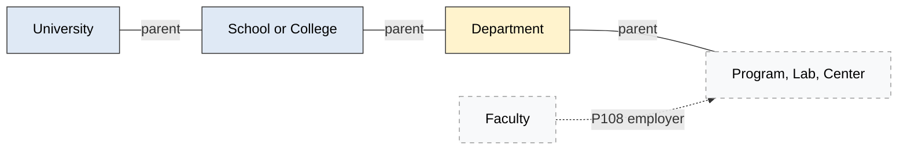
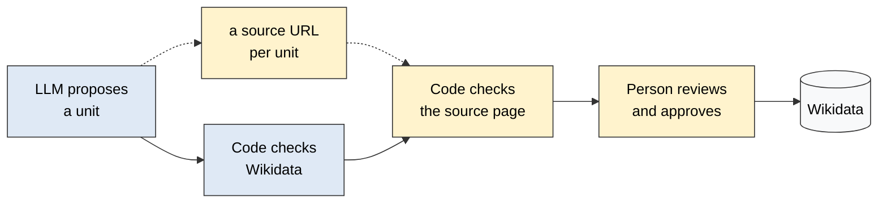

# AcademiaBot

**Putting the structure of every university into Wikidata.**

Wikidata knows that New York University exists. It mostly does not know that NYU has a
Stern School of Business, that Stern has a Department of Finance, or who teaches there.
This project fills that gap: university, then school, then department, then faculty, all
as linked Wikidata entities that anyone can query.

We use large language models to propose the units, code to check them against what
Wikidata already has, and people to approve every fact before it is published. Checking
each proposal against the university's own website is being built now (see TASKS.md).
The rule we are building toward: nothing goes into Wikidata without a written source that
a person has checked.



Blue: works today. Yellow: being built this term. Dashed: later. The parent link will
be P749 (parent organization); the exporter still writes P361 (part of) today, and
Anya's week 8 switches it.



Today the LLM gives one reference URL per answer, not one per unit. One URL per unit
is Anya's week 3.

## Who this is for

Students on this project **direct a coding agent** (Claude Code or similar). You will not
write most of the code. You decide what to build, check that it works on data you chose,
judge the data, and own what goes into Wikidata. If you can run a command and open a CSV,
you have the skills to start.

## Start here

Read these three files, in this order. They are short.

| File | What it is | When to read it |
|---|---|---|
| **[TASKS.md](TASKS.md)** | The plan: what exists, your first week, the milestones, and how to work with the agent | Today, then every week |
| **[docs/BACKGROUND.md](docs/BACKGROUND.md)** | Where the project came from and why we model things the way we do | Once, in your first week |
| **[AGENTS.md](AGENTS.md)** | The instructions the coding agent reads: code map, conventions, data model, cloud access | Skim once; point the agent at it |

## Your first hour

```bash
git clone https://github.com/ipeirotis-org/academiabot.git
cd academiabot
pip install -r wikidata_discover/requirements.txt pytest
cp env.example .env          # then put at least one LLM API key in .env (ask Panos)
python -m pytest tests -q    # all tests should pass
python -m wikidata_discover.scripts.wikidata_division_discover discover Q49210   # NYU
```

The last command asks an LLM for NYU's schools, checks each one against Wikidata, and
prints a table: already linked, exists but not linked (an "orphan"), or missing. If any
unit is missing or orphaned, it also writes two files to `wikidata_discover/results/`: a
CSV of those units and a QuickStatements file that could create them. For NYU today
nothing is missing, so only the JSON report is written. **Do not upload a QuickStatements
file.** Uploading is a human step, after review, described in TASKS.md (Anya's weeks 8
and 9, Shuo's week 9).

Or ask your agent to do all of this for you and explain the output. That is the normal
way to work here.

## What the code does today

| Command | What it does | Output |
|---|---|---|
| `discover <QID>` | Finds the schools and colleges of one university | Always `results/reports/<QID>_report.json`. If anything is missing or orphaned, also `results/missing_divisions_<QID>.csv` and `results/quickstatements_<QID>.qs` |
| `harvest` | Lists every U.S. university in Wikidata | `results/universities_us.json` |
| evaluation | Scores each LLM provider and judge setup against a hand-built answer key for 12 universities | `eval/results_summary.csv` |

All paths are under `wikidata_discover/`. The first two run as
`python -m wikidata_discover.scripts.wikidata_division_discover <command>`. The evaluation
is its own module: `python -m wikidata_discover.eval.run_eval`.

**Accuracy so far:** at the school level, the best configuration reaches about 95%
precision and 95% recall on the 12 evaluated universities. Departments are the current
work. The honest list of what does not work yet is in TASKS.md, section 1.

## Configuration

Copy `env.example` to `.env`. At least one LLM key is required.

| Variable | Purpose |
|---|---|
| `OPENAI_API_KEY` | Preferred. The only provider that currently uses web search |
| `ANTHROPIC_API_KEY`, `GOOGLE_API_KEY` | Fallbacks, and needed for the full evaluation |
| `LLM_MODEL`, `ANTHROPIC_MODEL`, `GEMINI_MODEL` | Override default model names |
| `WD_BOT_USERAGENT` | Identifies our requests to Wikidata. Put your email in it |

Keys also live in GCP Secret Manager; see AGENTS.md. Never commit `.env`.

## Repository map

```
TASKS.md                 The plan. Start here.
AGENTS.md                Instructions for the coding agent.
docs/                    Background, and later the review guide and modeling rules.
wikidata_discover/       The code.
  cli.py                 The two commands.
  discovery.py           Orchestrates: Wikidata lookup, LLM extraction, matching.
  llm_helpers.py         All LLM calls (OpenAI, Anthropic, Gemini).
  to_qs_wikidata.py      Turns results into a QuickStatements file.
  eval/                  Answer key for 12 universities and the scoring harness.
  results/               Everything the commands write.
tests/                   pytest suite. Run it before and after every change.
```

## Three rules

1. **Nothing goes into Wikidata without a person checking it against a source.** The
   agent never uploads. You upload, after review, with a URL for every fact.
2. **Verify what the agent tells you.** Run the command. Open the file. Count the rows.
3. **Keep TASKS.md current.** It is the project's memory between sessions and between
   students.

## Contact

Panos Ipeirotis, NYU Stern, pi1@stern.nyu.edu
