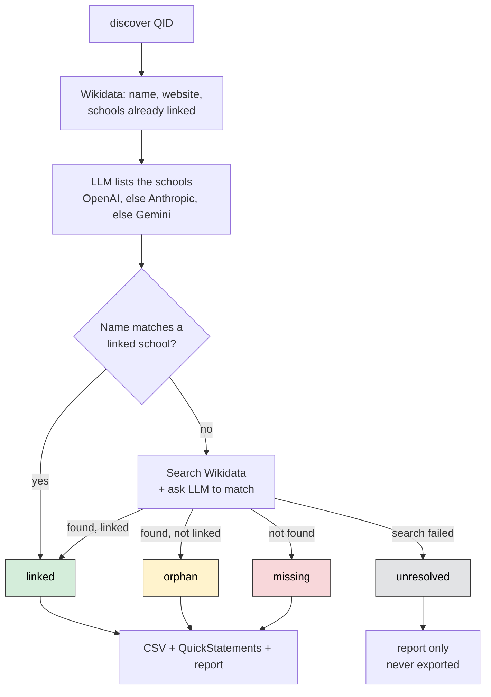
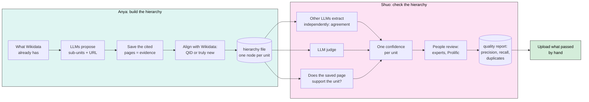
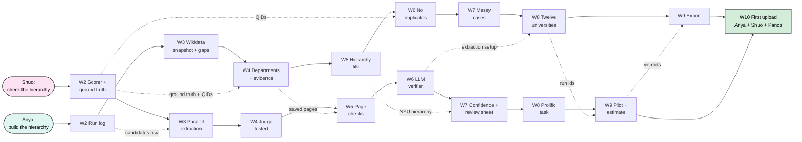

# TASKS.md

**Goal.** Build the structure of every U.S. university (university, then school, then
department) as a hierarchy we keep offline, aligned with Wikidata, with evidence for every
unit. Then measure how good that hierarchy is, with other LLMs, with the evidence, and with
people. Only what passes goes to Wikidata, by hand, at the end.

This file is the plan. It is written for two students, Anya and Shuo, who direct a coding
agent rather than write most of the code. Read it top to bottom once. Come back to your
track every week. If a word is unfamiliar, see the glossary at the end.

Last updated: 2026-10-04

---

## 1. What exists today

The code can do one thing well: **given a university, find its schools and colleges.**

```
python -m wikidata_discover.scripts.wikidata_division_discover discover Q49210
```

That command (Q49210 is NYU):

1. Looks up the university on Wikidata: name, website, and the schools already linked to it.
2. Asks an LLM to list the university's schools. It tries OpenAI first (with web search).
   If that fails, it tries Anthropic, then Gemini (without web search).
3. Checks each school the LLM named against what Wikidata already has. First by comparing
   names, then by asking an LLM when names are close but not identical.
4. Labels each school: already linked, exists but not linked (an "orphan"), or missing.
5. Writes the results to `wikidata_discover/results/`: a CSV, a QuickStatements file that
   could create the missing schools, and a small JSON report.



**How good is it?** We built the true list of schools for 12 universities by hand
(`wikidata_discover/eval/ground_truth.py`) and measured. The best setup, Anthropic judging
a merged list from OpenAI and Gemini, gets about 95% precision and 95% recall. The numbers
are in `wikidata_discover/eval/results_summary.csv`. Rerun with:

```
python -m wikidata_discover.eval.run_eval
```

All 12 are large, well-known universities. Research shows that LLMs do much worse on
less-known entities and on deeper levels of a hierarchy (see `docs/LITERATURE.md`). So
expect lower numbers for small colleges and for departments.

**School-level data for 1,519 universities is already collected.** The cloud run
`us-tier1` (in the bucket under `runs/us-tier1/`, finished 2026-10-03) ran `discover` on
1,519 U.S. universities. It proposed 9,190 schools: 2,327 already linked on Wikidata, 450
orphans, 6,413 "missing". Almost all answers came from OpenAI alone. 15% of the proposed
rows have no source URL.

A spot check of 40 random "missing" schools (2026-10-03, by hand plus Wikidata full-text
search) shows why that run is a starting point and not a result:

- At least 5 of the 40 already exist on Wikidata. Example: "Wheelock College of Education &
  Human Development" is Q4948183, labeled "Boston University Wheelock College of Education &
  Human Development". The pipeline's search did not find it. Creating it again would make a
  duplicate.
- One of them (Kent State Geauga) is already on Wikidata twice (Q61931599 and Q100993336).
- About 7 are not academic units: "Career Services", "Division of Student Affairs",
  "Academic Support Services".
- 3 are campuses, which our modeling rules do not yet cover.

So this semester has two jobs, one for each student:

- **Build** a hierarchy that creates no duplicates and has evidence for every unit (Anya).
- **Check** it well enough to know which parts are right (Shuo).

**What does not exist yet:**

- A hierarchy file. Today each run writes flat CSVs per university. (Anya, week 5.)
- A record of what was asked and what came back: raw responses, prompts, pages fetched.
  The LLM's cleaned-up answer is cached in `wikidata_discover/results/cache/`, nothing
  more. (Anya, week 2.)
- Saved copies of the pages the LLMs cite. (Anya, week 4.)
- Departments. The code only goes one level down. (Anya, weeks 4 to 5.)
- A search that finds existing Wikidata items under a different label. (Anya, week 6.)
- Web search for Anthropic and Gemini. They answer from memory, so the URLs they cite may
  not exist. (Anya, week 4.)
- Any check that a cited page says what the LLM claims, any measure of agreement between
  providers, any human review. (Shuo, weeks 3 to 9.)
- Nothing has been uploaded to Wikidata. (Both, week 10.)

**Collecting many universities at once.** The batch runner resumes where it stopped and
uploads every output to the `academiabot` bucket under `runs/<run_id>/`. It runs from a
terminal (`python -m wikidata_discover.scripts.batch_collect <run_id> <QID> ...`) or as a
Cloud Function called every 30 minutes by Cloud Scheduler. How to deploy, start, stop, and
watch a cloud run is in AGENTS.md ("Running collection in the cloud"). Only Panos starts a
cloud run, because it spends LLM credit.

Where the project came from and why we model things the way we do: `docs/BACKGROUND.md`.
What the research literature says about each step, with references: `docs/LITERATURE.md`.
Read both once.

---

## 2. The two tracks



**Anya's output: the hierarchy file.** One file per university. One node per unit. Every
node has:

- a stable id of our own (the same unit gets the same id on every run),
- a name, other names it goes by, and a type (school, department, program, center, other),
- its parent or parents (a list, because joint departments have two), and for each parent
  whether Wikidata already has that link,
- its Wikidata QID, or none,
- an alignment status, one of five:
  - **linked**: the QID exists, and Wikidata already has P749 from it to the parent.
  - **orphan**: the QID exists, but it has no P749 to the parent. A unit connected only
    through "part of", "has part", or similar is an orphan too, so the export adds the P749.
  - **new**: no item on Wikidata. We looked hard.
  - **pending**: on Wikidata, and waits only for a new parent to get its QID.
  - **uncertain**: we could not decide. It is never exported.
- the Wikidata items considered when aligning it, and why one was chosen or none,
- the evidence: the source URL, and a saved copy of the page with the date it was fetched,
- which run and which LLM calls proposed it.

The exact field list is in AGENTS.md ("Hierarchy file").

**Shuo's output: checks, reviews, and a quality report.**

- Every check on a unit is one row in a `checks` table. Examples: which providers named
  it, what the judge said, whether the page exists, whether the page supports the unit.
- Every human verdict is one row in a `reviews` table.
- Neither table is ever overwritten.
- From the two tables comes a quality report per run. It gives precision by level with a
  confidence interval, an estimate of recall, the share of cited pages that support their
  unit, and the duplicate rate.

**Each student also owns two small research questions** (section 8). They are built into
the weeks below, so the measurements happen as a side effect of the work.

---

## 3. How we work

You direct a coding agent (Claude Code or similar). The agent reads `AGENTS.md` for the
rules of this codebase and reads this file for what to do. You do the part the agent
cannot do:

- **Say exactly what to build.** Name your track and the week. Give the agent the
  "You check it by" steps of that week. That is the test it must pass. The agent reads
  the full build specification for the week in `SPECS.md`.
- **Check the result on data you chose.** Run the command. Open the file. Count the rows.
  Never accept "done" without seeing it work.
- **Judge the data.** Is this really a department? Is this URL really the right page? The
  agent guesses. You know, or you find out.
- **Own what goes into Wikidata.** The agent never uploads. A person does, after review.

Rules that keep things manageable:

1. One week of work per branch and pull request. Small steps.
2. Ask the agent for a short plan before it writes code. Read it. Push back if it is
   doing more than the week asks.
3. If the agent says tests pass, run them yourself: `python -m pytest tests -q`.
4. At the end of each session, have the agent tick your boxes in this file, add anything
   it learned to `AGENTS.md`, and summarize the change in the pull request.
5. Keep a short log for Panos: date, what you tried, what worked, what you decided.
6. Weekly meeting: bring the "Hand to Panos" item of your week.
7. Every number you report says what it was measured on (how many units, which
   universities) and, from week 5 on, comes with a confidence interval.

---

## 4. Week 1 for both of you (Oct 2 to 8): get set up

- [ ] Ask the agent to install dependencies and run the tests. All should pass (142 today).
      The cloud tests need `wikidata_discover/cloud/requirements.txt` installed too.
- [ ] Get API keys working. Today the code reads keys only from `.env`: copy `env.example`
      to `.env` and paste at least one key (ask Panos). Never commit `.env`. After Anya's
      week 2 lands, the keys will come from Secret Manager and `.env` becomes optional.
- [ ] Run discovery on NYU (Q49210). Open `wikidata_discover/results/reports/Q49210_report.json`.
      (NYU's schools are all linked already, so no CSV is written for it. A university with
      missing schools also gets a CSV and a QuickStatements file.)
- [ ] Run it on a university you know well. Is the list of schools right? Note what is wrong.
- [ ] Open 10 rows of the `us-tier1` results in the bucket (`runs/us-tier1/missing_divisions_*.csv`),
      from universities you have never heard of. For each "missing" school, search Wikidata
      by hand. Is it really missing? Is it really a school?
- [ ] Ask the agent to walk you through the pipeline using `discovery.py` as the guide.
      Then ask it the question that confused you most.
- [ ] Run the evaluation and compare its numbers to `wikidata_discover/eval/results_summary.csv`.
- [ ] Read `docs/BACKGROUND.md`, and in `docs/LITERATURE.md` the part for your track.
- [ ] Write one paragraph for Panos: what the pipeline does, and one thing you would change.

---

## 5. Anya's track: build the hierarchy

Your question for the semester: **can the code build each university's hierarchy so that
every unit either points to the right Wikidata item or is truly new, and say where each
unit came from?**

| Week | Dates | Goal |
|---|---|---|
| 2 | Oct 9 to 15 | Record everything |
| 3 | Oct 16 to 22 | What Wikidata already has, and what is missing |
| 4 | Oct 23 to 29 | Departments, with evidence |
| 5 | Oct 30 to Nov 5 | The hierarchy file |
| 6 | Nov 6 to 12 | No duplicates |
| 7 | Nov 13 to 19 | The messy cases |
| 8 | Nov 20 to 26 | Twelve universities (light week, Thanksgiving) |
| 9 | Nov 27 to Dec 3 | A correct export |
| 10 | Dec 4 to 10 | Page first, and the first upload |
| 11 | Dec 11 to 17 | Cleanup and final report |

Each week below has four parts. **Ask the agent to build** is the short version; the agent
reads the full version in `SPECS.md`. **You check it by** is the acceptance test: do every
step yourself. **You do yourself** is the part only a person can do. **Hand to Panos** is
what you bring to the weekly meeting. Tick its box when you hand it over.

### Anya, week 2 (Oct 9 to 15): record everything

**Goal.** Every run leaves a full record, so that anyone can repeat it and check it.

**Ask the agent to build:**

- A run log in BigQuery with four tables:
  - `runs`: one row per command run.
  - `llm_calls`: every prompt and raw response.
  - `evidence`: every web page fetched.
  - `candidates`: every unit proposed, linked to the calls and pages that produced it.
- Large text in Cloud Storage. The table row keeps the path.
- Local JSON files under `wikidata_discover/results/runs/` when GCP cannot be reached.
- `config.py` reads API keys from Secret Manager when `.env` has none.

**You check it by:**

1. Run discovery on NYU twice. Both runs appear in BigQuery.
2. Open one raw LLM response in Cloud Storage. Find a school name in it.
3. Delete `.env` and run again. It still works.
4. Make the cloud writer fail. For example, point it at a bucket that does not exist.
5. Run again. The run, calls, evidence, and candidates must all be in
   `wikidata_discover/results/runs/`.

**You do yourself:** Decide what one `candidates` row must contain, so that Shuo can check
it later without asking you. Write the list down and give it to Shuo.

- [ ] **Hand to Panos:** the table schema on one page, and a screenshot of a real run in
  BigQuery.

### Anya, week 3 (Oct 16 to 22): what Wikidata already has, and what is missing

**Goal.** Know what Wikidata has for each university, so that we never create a unit that
already exists.

**Ask the agent to build:**

- A `snapshot <QID>` command. It saves every unit below a university, as Wikidata has it
  today, through P749, P361, P527, P355, and P199.
  - It keeps every statement except deprecated ones, with the rank and qualifiers of each.
  - It also keeps each unit's own parents. So a second parent outside the university's tree
    is kept too (NYU Shanghai also has P749 to East China Normal University).
  - For each unit it keeps labels, other names, P31, website (P856), ROR id (P6782), and
    parents.
- A one-time import of the `us-tier1` results into `candidates`, marked "legacy". No raw
  response, prompt, or saved page was kept for these rows, and the record must show that.
- A gap report over the 1,519 universities, with one row per university:
  - units on Wikidata;
  - units the LLM proposed, and how many are linked, orphan, and missing;
  - units in the old crowd table (`docs/BACKGROUND.md`), where it has the university.

**You check it by:**

1. For NYU, run the second query in section 11 by hand. Every unit it returns must be in
   the snapshot.
2. That query sees only best-rank statements, so the snapshot can hold more. Check one
   extra unit by hand.
3. Pick 5 units. Compare the snapshot with each unit's Wikidata page. Other names, P31,
   website, ROR id, and parents must all match.
4. Take 20 random "missing" schools from the gap report. Search Wikidata for each by hand.
   Also try "university name + school name".
5. Write down how many already exist and how many are not schools at all. That count is
   the baseline for week 6.

**You do yourself:** Read the gap report. Pick the 5 universities with the biggest gap
between Wikidata and the LLM. Check two of them by hand: who is right?

- [ ] **Hand to Panos:** the gap report, and your baseline: of 20 "missing" schools, how
  many were not missing, and how many were not schools.

### Anya, week 4 (Oct 23 to 29): departments, with evidence

**Goal.** Go one level down, and save the page that shows each unit exists.

**Ask the agent to build:**

- An LLM step that takes any unit (a university or a school) and returns its sub-units.
- For each sub-unit: a name, a type (department, program, center), a website if known,
  **one source URL**, and a country with the page or address that shows it. The parent's
  country is only a first guess: NYU Abu Dhabi is not in the U.S.
- Web search or grounding for Anthropic and Gemini too.
- A `--provider` option that runs one provider alone, so Shuo can compare them.
  `discover` keeps the first provider that answers until week 8.
- A page fetcher. It saves every cited page once, in the `evidence` table: HTTP status,
  final URL after redirects, content hash, and page text. A unit without a URL stays in
  the results, with a flag.
- Safety rules for the fetcher, because the URLs come from an LLM. It follows only `http`
  and `https`. It refuses addresses that are not public. It stops after 5 redirects, 5 MB,
  or 20 seconds. It records a refused URL as refused. `SPECS.md` has the full rules.

**You check it by:**

1. Run it on the three NYU schools in Shuo's ground truth (Stern, Courant, Steinhardt).
   Score each with Shuo's scorer.
2. Open 5 saved pages. Find the unit's name in each.
3. Give it one dead URL on purpose. It must save the URL with its status, and the run must
   not crash.
4. Run it on NYU itself. NYU Abu Dhabi and NYU Shanghai must come out with their own
   countries and a page for each.
5. Give it `http://localhost/`, `http://169.254.169.254/`, and a public URL that redirects
   to one of them. All three must be refused, and nothing fetched from them.
6. Ask for a test with a hostname whose DNS answer changes from public to private after
   the check. The fetcher must contact only the public address it checked, never the
   private one.

**You do yourself:** Agree with Shuo on what counts as a department. Write the answer in
`docs/MODELING_RULES.md`. Start with the easy cases. Add campuses and administrative
offices (career services, student affairs), because the spot check found both in
`us-tier1`.

- [ ] **Hand to Panos:** department lists for the three schools, with the score for each.

### Anya, week 5 (Oct 30 to Nov 5): the hierarchy file

**Goal.** One file per university that holds the whole tree, with ids that do not change.

**Ask the agent to build:**

- `discover --depth 2` writes one hierarchy file per university. The format is in
  AGENTS.md ("Hierarchy file").
- Each node has a stable id, its parents, and a QID or none. For each parent, it says
  whether the link exists on Wikidata. It also has an alignment status, its evidence, and
  the run and calls that proposed it.
- Every in-scope unit from the week 3 snapshot goes in, even if no LLM named it. Its
  departments are looked up like any other unit's. It also gets the week 4 evidence step:
  a saved source page and its country.
- When alignment matches a unit to an item outside the snapshot, the agent crawls that
  item's Wikidata subtree and adds it to the file.
- Ids come from a register. A unit keeps its id when it is renamed, moved, or later
  matched to a QID.
- The same nodes go into a `nodes` table in BigQuery. Every level goes into the run log.

**You check it by:**

1. Run `discover --depth 2 Q49210`. Open the file.
2. Pick 10 departments at random. Is each under the right school? Is the type right? Is
   the QID right, or rightly empty?
3. Every node has a source URL or a flag.
4. Every school in NYU's snapshot is in the file and has its departments looked up. This
   includes one school that you remove from the LLM's answer by hand.
5. Run it a second time. The same unit gets the same node id.
6. Rename one unit and give another a QID. Run again. Both keep their ids.

**You do yourself:** Note every oddity: a department under two schools, two departments
with the same name, a "school" that is really a program, one unit under two names. These
feed weeks 6 and 7.

- [ ] **Hand to Panos:** NYU's hierarchy file, your list of oddities, and the midpoint
  report: cost and time per university, and the share of units with a saved page.

### Anya, week 6 (Nov 6 to 12): no duplicates

**Goal.** Never call a unit "new" when Wikidata already has it.

**Ask the agent to build:**

- A harder search before a unit is called "new":
  - full-text search, not only label prefix (prefix search missed "Boston University
    Wheelock College...");
  - the name with the university's name in front;
  - other names and abbreviations;
  - the website domain (P856);
  - items whose parent is a unit already in the tree.
- An LLM then picks one of the candidates, or none. It chooses from the list; it does not
  answer yes or no for each candidate.
- Merge nodes in our own tree that are the same unit under two names.
- When Wikidata has two items for one unit, flag it for a person. Never merge on Wikidata.
- Every node records the candidates it looked at and the reason for the choice.
- Behind a flag, a second way to decide: a yes-or-no question for each candidate. It is the
  baseline for research question A1.

**You check it by:**

1. Shuo's ground truth has a QID column. Every unit with a QID must now link to that QID.
   Count the misses.
2. Run the 20 schools from your week 3 baseline again. How many now get the right QID?
3. Run NYU twice. The second run adds no nodes.

**You do yourself:** research question A1 (section 8).

1. Draw 150 units from `us-tier1` at random: 100 that it called missing, and 50 that it
   called linked or orphan. Record the seed.
2. Label each by hand: the right QID, or "none". If Wikidata has two items for the unit
   (like Kent State Geauga), write all of them.
3. A link to any one of the duplicates counts as right. Score separately whether the
   pipeline flagged the duplicate.
4. Measure the false-new rate and the false-link rate, before and after this week. Record
   which search found each item. (False-new: of the units a method calls new, the share
   that have a QID. False-link: of the units a method gives a QID, the share given the
   wrong one.)
5. Run both ways to decide (choose from the list; yes or no per candidate) on the same 150
   units.

- [ ] **Hand to Panos:** false-new and false-link rates, before and after, per kind of
  search and per way to decide. Report them per stratum (called missing; called linked or
  orphan) and overall. Compute the overall rate in three steps:
  1. Give each labeled unit a weight: the size of its stratum in `us-tier1`, divided by
     the number you sampled from it.
  2. Add up the weights in the numerator, and separately the weights in the denominator.
  3. Divide the first sum by the second.

  Do not average the two stratum rates, because a method can move units between "new" and
  "linked".

### Anya, week 7 (Nov 13 to 19): the messy cases

**Goal.** The code follows `docs/MODELING_RULES.md` for the hard cases.

**Ask the agent to build:** code that applies the rules, with one test per rule:

- A joint department gets two parents, each link with the rank and qualifiers the rules set.
- Departments with the same name stay separate.
- Renamed units, campuses, and offices are handled as the rules say.

**You check it by:** Give it the oddities from week 5. Each must come out as the rules say.

**You do yourself:** Finish `docs/MODELING_RULES.md` with Panos: at least 5 real cases,
each with the decision and the reason.

- [ ] **Hand to Panos:** the rules doc and the passing tests.

### Anya, week 8 (Nov 20 to 26): twelve universities

Light week, Thanksgiving.

**Goal.** Run the full build on all 12 ground-truth universities.

**Ask the agent to build:**

- An `--extract` flag that picks the extraction setup: one provider, or two generators and
  a judge.
- Set it to the setup Shuo chose at the end of week 6. Run depth 2 on the 12 universities,
  write it to the run log, and make a summary table per university.

**You check it by:**

1. Pick one university. Recount its summary row by hand from the hierarchy file.
2. Run one university again in replay mode. Replay reuses what was stored with the run,
   and asks nothing again:
   - the Wikidata snapshot and the saved pages;
   - the stored response of every alignment search (prefix, full-text, website, parent);
   - the run's own copy of the id register and cross-register decisions, read-only.
3. The replay must be fast, and the numbers must be identical. (A normal rerun can differ,
   because Wikidata or a page changed. That is correct.)

**You do yourself:** Give the run ids to Shuo.

- [ ] **Hand to Panos:** the 12 hierarchy files and the summary table.

### Anya, week 9 (Nov 27 to Dec 3): a correct export

**Goal.** Turn reviewed units into QuickStatements files that Wikidata editors will accept.

**Ask the agent to build** (the full rules are in `SPECS.md`):

- An exporter that reads the hierarchy file and the `reviews` table. It writes one file per
  level and links with P749, not P361.
- A reference on every statement: the saved page for that fact, with the date retrieved.
- One rule per alignment status:
  - **new**: the minimum statement set, a P749 to every parent, and P17 from the node's own
    country (never assumed from the university).
  - **orphan**: only the missing P749 statements, and missing qualifiers on an existing one.
  - **linked**: no statement.
  - **pending**: waits for `ingest-qids`.
  - **uncertain**: never exported.
- A "fix" verdict is never exported directly. The correction goes into the hierarchy file.
  That makes a new node version, which needs its own accept.
- The rule for which verdicts allow export comes from `review_protocol.json`. The default
  is one blind expert accept and no reject. The export refuses to run if the file is
  missing or invalid.
- A manifest next to each file. It lists each statement with its node, version, and
  reviews, and each unit left out with the reason.
- An `ingest-qids` command. After a school batch is uploaded, it records the new QIDs (a
  person confirms each one) and reruns alignment for their departments.

**You check it by:**

Warning: preview only. Do not run the file in QuickStatements.

1. Paste the file into the QuickStatements web tool in preview mode. Every statement shows
   a reference.
2. Mark 3 rows reject, 1 row fix with a corrected name, and 1 row fix with a corrected
   parent. Export again.
3. The 3 rejected rows must be absent. The 2 fixed rows must be held back until you accept
   their new versions. Then they must carry the corrections.
4. Give one row an accept and a second reviewer's reject. Under the default rule, the row
   is refused.
5. Set the rule to two accepts. Give one row two accepts from the same reviewer (blind and
   second pass). The row is refused.
6. Delete `review_protocol.json`. The export refuses to run.
7. One new unit outside the U.S. gets its own country in P17. One joint unit gets two P749
   statements with their qualifiers.
8. Linked units appear in the manifest as "already linked".
9. Remove one verdict. The export must refuse that row.
10. Open the manifest next to the export. It has one line per statement, with its node and
    version.
11. Take one existing department under a new school. After `ingest-qids`, the department
    file adds its P749.
12. Take one existing joint unit whose second P749 lacks its qualifiers. The file adds
    them. A wrong rank appears in the manifest as a hand edit.

**You do yourself:** Read every line of the NYU export.

- [ ] **Hand to Panos:** the NYU export file, previewed and accepted by the tool.

### Anya, week 10 (Dec 4 to 10): page first, and the first upload

**Goal.** Fix what the upload needs, test a second way to extract (research question A2),
and put the first university on Wikidata.

**Ask the agent to build:**

- First, the fixes the upload needs.
- Then an `--extract page-first` mode. It finds the unit's own page that lists its
  sub-units (on the unit's website, else by search) and saves it. It extracts units from
  the saved text only, and each unit cites that page.

**You check it by:**

1. Do the week 5, week 6, and week 9 checks again.
2. Run Stern in page-first mode. Every unit cites the one saved page, and its name is in
   the text of that page.
3. Run both modes on the 6 ground-truth schools and score them. Run Shuo's verifier on
   both.

**You do yourself:** the **first upload**, with Shuo and Panos.

Warning: upload only if the result meets the bar in Shuo's `docs/REVIEW_PROTOCOL.md`.

1. Pick the university with the best quality report.
2. Rerun alignment for its schools against today's Wikidata. An editor can have created a
   "new" unit or added a link since week 8. Each changed unit gets a new version.
3. With Shuo, review every school on its current version. Earlier verdicts can be on older
   versions, and the export refuses those.
4. Export the schools. Review every line. Upload under your own Wikidata account. Record
   the batch id in this file.
5. Run `ingest-qids`. Departments under new schools get a new version.
6. Rerun alignment for all its departments against today's Wikidata. Only then review the
   departments.
7. Export and upload the departments the same way.
8. Query Wikidata with the SPARQL in section 11 to confirm the upload.

- [ ] **Hand to Panos:** the departments of one university live on Wikidata, or a written
  reason why not yet.

### Anya, week 11 (Dec 11 to 17): cleanup

**Ask the agent to:** clean up. All tests pass. Boxes ticked in this file.

**You check it by:** Run the tests yourself. Read this file: does it say what was done?

**You do yourself:** Write your final report, with a two-page note on A1 and A2.

- [ ] **Hand to Panos:** the report: what the pipeline can do, its numbers, cost per
  university, the false-new rate, and what the next person should do first.

**Done when:**

- `discover --depth 2` writes a hierarchy file for 12 universities.
- Every unit has a saved source page or a flag.
- Every unit is linked, orphan, new, pending, or uncertain, for a recorded reason.
- The false-new rate is measured.
- The export is correct, and every statement has a reference.
- The departments of one university are live on Wikidata.

**If something is late.** Week 4 needs Shuo's ground truth for the three NYU schools (Shuo's
week 2). If it is late, build the Stern list yourself from the Stern website. Week 8 needs
Shuo's choice of extraction setup (Shuo's week 6). If it is late, use Anthropic judging
OpenAI plus Gemini, the best setup at the school level.

---

## 6. Shuo's track: check the hierarchy

Your question for the semester: **for every unit in the hierarchy, how sure are we that it
is right, and which checks are worth what they cost?** You build four kinds of check, in
this order:

1. Other LLMs extract the same list independently, and we count agreement.
2. An LLM judge reviews the merged list.
3. Code checks the saved page against the claim.
4. A person gives a verdict. Nothing enters Wikidata without this one.

| Week | Dates | Goal |
|---|---|---|
| 2 | Oct 9 to 15 | A scorer, and the department ground truth |
| 3 | Oct 16 to 22 | Parallel extraction: do independent LLMs agree? |
| 4 | Oct 23 to 29 | The LLM judge, tested |
| 5 | Oct 30 to Nov 5 | Does the page exist and name the unit? |
| 6 | Nov 6 to 12 | The LLM verifier |
| 7 | Nov 13 to 19 | One confidence per unit, and a review sheet |
| 8 | Nov 20 to 26 | A Prolific task, ready to launch (light week, Thanksgiving) |
| 9 | Nov 27 to Dec 3 | Prolific pilot, and the quality estimate |
| 10 | Dec 4 to 10 | Pre-upload check, and the first upload |
| 11 | Dec 11 to 17 | Cleanup and final report |

The four parts of each week work as in section 5.

### Shuo, week 2 (Oct 9 to 15): a scorer

**Goal.** A tool that scores any list of departments against a hand-built answer key.

**Ask the agent to build:**

- A loader for a department ground-truth CSV. One row per department: parent, name, type,
  `source_url`, `qid`.
- A scorer for any list against it: precision and recall on names, and alignment accuracy
  on QIDs (the right QID, or rightly "new").
- When parents are given, also edge F1 (right parent) and ancestor F1 (right university).
- Matching is one to one, within the same parent:
  - One proposed name can match only one true department.
  - A repeated name counts once.
  - Two departments with the same name under different schools are different rows.

**You check it by:**

1. Give it your own ground-truth list plus 2 made-up department names. Recall must be 100%,
   with exactly 2 wrong names (precision = N/(N+2) for N real names).
2. Remove 1 real name. Recall must be (N-1)/N.
3. Change one QID. Alignment accuracy must drop by exactly 1/N.
4. Propose one real department twice. It counts once, and precision drops.
5. Make two departments with the same name under two schools, and propose one under the
   wrong school. One is right and one is wrong.

**You do yourself:**

1. Build the ground truth for Stern, Courant, and Steinhardt from their websites, with one
   URL per department.
2. For each department, search Wikidata by hand. Write the QID, or write "none" if you
   looked and found nothing.
3. Start from the old BigQuery table (`docs/BACKGROUND.md`), but confirm every row
   yourself.

- [ ] **Hand to Panos:** the ground-truth CSV, about 40 to 60 rows, every row with a URL you
  visited and a QID column. Give it to Anya too.

### Shuo, week 3 (Oct 16 to 22): parallel extraction

**Goal.** Find out whether independent LLMs agree, and whether agreement means a school is
real.

**Ask the agent to build:**

- Each provider lists the schools on its own, 3 runs each, through the existing
  extractors. It does this for the 12 eval universities, and for the 6 small universities
  below as soon as their ground truth is ready.
- Each run has a sample number in its cache key. So the three runs are three real calls,
  and a rerun replays the same three answers.
- Name variants of one school are grouped ("Dept. of CS" and "Computer Science").
- One row per proposed school in a new `checks` table: how many providers and runs named
  it.
- A table: precision at each level of agreement, and how often provider B names a wrong
  school when provider A did.
- Research question S1 (section 8): estimate the number of schools at each university
  from the overlap between providers. Compare it with the true count. `SPECS.md`
  gives the two ways to count this week, and a third way in week 5.
- Each provider's invented and non-academic proposals, reported separately.

**You check it by:**

1. Run it twice. The numbers must be identical (the cache works).
2. The cache folder has 3 files per provider and university, not 1.
3. Recount two universities by hand from the raw lists. Make one of them small.

**You do yourself:**

1. Build a school-level ground truth for 6 small universities, because our 12 are all
   famous. "Small" means the bottom third of `us-tier1` by the number of Wikipedia articles
   about the university (Wikidata sitelinks). Draw the 6 at random from that third, and
   record the seed.
2. Read 20 schools that only one provider named. Is each one real?

- [ ] **Hand to Panos:** the agreement table, and the first recall estimate next to the
  true count.

### Shuo, week 4 (Oct 23 to 29): the LLM judge, tested

**Goal.** Find out whether an LLM judge helps, and how it is biased.

**Ask the agent to build:**

- Each provider takes a turn as judge of the merged list.
- Each judge runs four times: twice with the list in one order, and twice in another
  order. Each call has its own cache entry, as in week 3.
- A report with three parts:
  - How often a verdict flips between two runs in the same order (normal randomness), and
    between two orders. The order effect is the difference.
  - Whether a judge keeps its own provider's schools more often than others', at the same
    correctness.
  - Whether the judge gains in precision (it removes wrong ones) or in recall (it keeps
    right ones).
- The same test on departments. Each provider lists the departments of the six
  ground-truth schools on its own, with Anya's week 4 `--provider` option, 3 runs each with
  sample numbers.

**You check it by:**

1. Make one list by hand, with 3 fake schools added. Does each judge remove them?
2. The order test runs on all 12 universities. It reports both flip rates: same order and
   different order.

**You do yourself:** Extend the department ground truth to three schools outside NYU: one at
a large public university, one at Howard, and one at a small college. Use the same columns.

- [ ] **Hand to Panos:** the judge table, and the department ground truth for 6 schools.

### Shuo, week 5 (Oct 30 to Nov 5): does the page exist and name the unit?

**Goal.** Simple, mechanical checks on every saved page.

**Ask the agent to build:**

- Four checks over Anya's `evidence` table:
  - dead links;
  - pages that say "not found" with status 200;
  - pages off the university's domain;
  - whether the unit's name is on the page (small differences allowed).
- First, a new run of each provider with search on. Anya's week 4 turned on search for
  Anthropic and Gemini, after your week 3 lists. Use the same universities, and the
  departments of the six ground-truth schools.
- Then Anya's fetcher on the URLs each provider cited, so every provider has saved pages to
  count.
- Search-off and search-on results reported separately. The week 6 choice uses search-on.
- The same checks on 300 random school URLs from `us-tier1` (almost all OpenAI; report them
  separately).
- One row in `checks` for each result.

**You check it by:** Give it 10 URLs you picked: 2 dead, 2 real but about something else, and
6 correct. It must sort all 10 as you did.

**You do yourself:**

1. Label 100 claim-and-page pairs ("X is a department of Y", and the saved page):
   supported, not supported, or unclear.
2. Draw the pairs at random from all saved pages, a third per provider, dead and odd pages
   included. Record the draw so that it can be repeated.
3. Read 20 failures and sort them: dead link, wrong page, right page but different name,
   made-up URL.

- [ ] **Hand to Panos:** the midpoint report. Per provider: the share of cited URLs that
  exist and support the unit, with confidence intervals (from the week 3 lists, where all
  three providers answered the same questions). Also the agreement and judge tables.

### Shuo, week 6 (Nov 6 to 12): the LLM verifier

**Goal.** An LLM reads the saved page and says whether it supports the claim.

**Ask the agent to build:**

- Input: a claim and the saved page. Output: supported, not supported, or unclear, with a
  quote of the sentence that decides it.
- Long pages are split into overlapping pieces that fit the model:
  - supported, if any piece supports the claim;
  - not supported, if every piece was read and none supports it (a wrong page that never
    names the unit is not supported, as in your week 5 labels);
  - unclear, only if the page could not be read or the deciding text is ambiguous.
- If the quote is not in the saved page word for word, the answer becomes unclear.
- Two versions: one with a provider's model, and, for cost, one with MiniCheck, a small
  checker. MiniCheck answers only supported or not, with a probability, and gives no quote.
  So it is scored as a yes-or-no checker.

**You check it by:**

1. Compare the LLM verifier with your 100 labels: accuracy and the three-way confusion
   matrix, per provider.
2. Give the overall number in two ways: provider-balanced (as sampled), and weighted by
   each provider's share of all saved pages. Say which number is which.
3. Compare MiniCheck with the same labels collapsed to two (supported, against everything
   else). Collapse the LLM verifier the same way, so that the two compare on equal terms.
4. Spot-check 10 LLM quotes against the page.
5. Use one test page that is longer than the model can read at once, with the supporting
   sentence near the end. The answer must be supported.

**You do yourself:**

1. Decide what verifier accuracy is good enough to sort the review sheet by.
2. Rerun the week 4 judge test on the search-on lists from week 5. A judge chosen on lists
   from memory can behave differently on the lists it will really see.
3. Choose the extraction setup for departments (which generators, which judge) from weeks
   3 to 6. Use search-on numbers only. Score each provider as a generator on its own
   department lists for the six ground-truth schools.
4. Give the choice to Anya.

- [ ] **Hand to Panos:** verifier accuracy with the confusion matrix, and the setup choice
  with the numbers behind it.

### Shuo, week 7 (Nov 13 to 19): one confidence per unit, and a review sheet

**Goal.** One confidence per unit, and a sheet that people can review fast and blind.

**Ask the agent to build** (the full field list is in `SPECS.md`):

- One confidence per node of a hierarchy file. It uses only checks recorded against the
  node's current version. Start with a simple rule, such as "all providers agree and the
  page supports it" = high.
- The agreement and judge checks from weeks 3 and 4 were on candidates, before nodes
  existed. Recompute them for each node and record them against its current version first.
- A `review` command that writes one row per node. The row shows every value the export
  would write:
  - parent, name, type, and QID or new;
  - the Wikidata items that alignment considered;
  - the country and its source;
  - the description and website a new item would get, and the source URL;
  - for each parent link: its rank, qualifiers, and page.
- Two passes:
  - First pass: rows in random order, checks and confidence hidden. The reviewer records a
    verdict.
  - Second pass: checks shown, doubtful rows first. The reviewer can record a second
    verdict.
- Columns to fill: `verdict` (accept, reject, fix), one `fix_` column for each value on the
  row, and `notes`. A fix to a fact with its own reference (the source, the country, a
  parent link) must come with a URL.
- An accept needs `url_checked` = yes for every evidence page on the row, page by page. A
  fix records yes or no per page, with the corrected URL.
- Each verdict is its own row in the `reviews` table. It records the run, the node version,
  the pass, and a hash of the row as shown. It never overwrites another reviewer's row.

**You check it by:**

1. Mark 3 rows reject and 2 rows fix (one name; one parent and QID together). Save and
   reopen. The verdicts and each corrected field must still be there.
2. A second reviewer's verdict on the same row is a new row.
3. Change the source URL of one reviewed unit in a later run. Its old verdict no longer
   counts, and it shows up again as unreviewed.

**You do yourself:**

1. Review NYU's sheet (Anya's week 5 file), and time yourself.
2. Panos reviews the same sheet independently.
3. Compare every disagreement.
4. Did low confidence predict your rejects? Answer from your first-pass verdicts only,
   given before you saw the confidence.

- [ ] **Hand to Panos:** `docs/REVIEW_GUIDE.md` (one page, written from the disagreements),
  your agreement with Panos, and how well the confidence predicted your verdicts.

### Shuo, week 8 (Nov 20 to 26): a Prolific task, ready to launch

Light week, Thanksgiving.

**Goal.** A paid review task on Prolific, ready to launch.

**Ask the agent to build:**

- One parent link per item: the unit's name, one of its parents, and the saved page as a
  picture (not copyable text).
- The worker answers accept, reject, or fix. The worker judges only the claim ("this page
  shows X is a unit of Y"). QIDs stay with experts, because they need Wikidata searches
  that a short paid task cannot ask for.
- One qualification question.
- Gold items, made by changing units you checked: the wrong parent, a fake unit, the wrong
  page.
- Two versions: one shows the verifier's answer, and one does not. Each worker gets one
  version at random. A worker who took one version is excluded from the other (Prolific's
  exclusion list), so no blind answer comes from someone who saw the verifier's answers.
- Instructions that ask workers directly not to use AI tools.
- A script that computes agreement with your verdicts.

**You check it by:**

1. Do the task yourself as a worker.
2. Ask Panos to do 10 items.
3. Fix every instruction that confused either of you.

**You do yourself:** Write 20 gold items.

- [ ] **Hand to Panos:** the task, ready to launch.

### Shuo, week 9 (Nov 27 to Dec 3): Prolific pilot, and the quality estimate

**Goal.** Measure how good the workers are, and how good the hierarchy is.

**Ask the agent to build** (the full design is in `SPECS.md`):

- A random sample of about 150 parent links from Anya's 12-university run. One item per
  unit and parent, so a joint unit gives two items.
- A launch with 3 workers per item that has a saved page, in the version that hides the
  verifier's answer. A second set of workers does the same items in the version that shows
  it.
- Three worker analyses, on the items with a saved page (say how many):
  - worker accuracy against your blind "supported" labels;
  - Dawid-Skene against simple majority;
  - the effect of showing the verifier's answer.
- Research question S2 (section 8): the precision of all 12 hierarchies (the share of
  parent links that are true). Estimate it from the human sample alone, and from the human
  sample plus verifier labels on every link.
- Precision uses your "true" label, not page support. A real unit with a dead page is still
  true. Page support is reported as its own rate.
- QID accuracy over the distinct units in the sample, each weighted by the inverse of its
  chance to be drawn (a joint unit had about twice the chance). Say how many units.
- Only verdicts from the version that hides the verifier's answer go into the estimates.
  The other version measures anchoring only.
- Sampled items with no saved page stay in the sample. Workers do not see them. The
  verifier counts them as not supported. Your labels decide whether they are true. Report
  their share.

**You check it by:** Recompute one reported number by hand from the raw rows.

**You do yourself:**

1. Before launch, label all 150 items yourself, blind, in three parts:
   - **true:** is it a real unit of that parent, by any source you can find? Write
     "cannot tell" when nothing decides it. Report those separately and count them both
     ways.
   - **supported:** does the saved page show it? Write no when there is no page.
   - **alignment:** is its QID, or "new", right?
2. Score workers against "supported" only, because the page is all they see.
3. After the pilot, read every item where workers disagreed.

Budget guide: about 20 cents per unit in the old project.

- [ ] **Hand to Panos:** the pilot report: accuracy, cost and time per unit, the anchoring
  effect, a go or no-go on scaling, and precision with its interval both ways.

### Shuo, week 10 (Dec 4 to 10): pre-upload check, and the first upload

**Goal.** A last gate that refuses any file that is not exactly what the reviews allow.

**Ask the agent to build** (the full rules are in `SPECS.md`):

- A command that reads an export file and its manifest. It checks them against the
  hierarchy file, the `reviews` table, and `review_protocol.json`. It refuses to run if the
  protocol file is missing or invalid.
- It needs a complete review of the chosen university, on current versions, after the last
  alignment refresh. It refuses if any current unit has no verdict, or if the share of units
  accepted without correction is below the protocol's minimum.
- It regenerates the export. It refuses the file if any statement, value, rank, qualifier,
  or reference differs.
- It refuses a statement with no reference, no manifest line, or no accept on the node's
  current version. It refuses if an in-scope node is missing from both the file and the
  manifest's list of nodes left out.
- The week 9 estimate is recorded with the batch for context. It does not decide the
  batch, because it was measured on earlier versions.

**You check it by:**

1. Remove one verdict and run it. It must refuse.
2. Restore the verdict. It must accept.
3. Set one accepting verdict's `url_checked` to no. It must refuse.
4. Raise the protocol's minimum above the university's accepted share. It must refuse.
5. Delete one statement's manifest line. It must refuse.
6. Edit one P17 value in the export file by hand. It must refuse.
7. Delete a node from both the file and the manifest. It must refuse.

**You do yourself:**

1. Write `docs/REVIEW_PROTOCOL.md`. It says who reviews what, how many reviewers there
   are, and what agreement is needed. It also sets the minimum share of a university's
   units that its complete review must accept without correction before upload.
2. Put the same rule in `review_protocol.json`. The export and the pre-upload check both
   read it, so the two files must agree.
3. Before the first upload, review every unit of the chosen university on its current
   version, with Anya. Review the schools first, and the departments after `ingest-qids`
   (Anya's week 10).
4. Do the **first upload** with Anya and Panos.
5. Watch the uploaded items. If a Wikidata editor changes something, find out why.

- [ ] **Hand to Panos:** the protocol, and the first batch on Wikidata with references, every
  one checked by a person.

### Shuo, week 11 (Dec 11 to 17): cleanup

**Ask the agent to:** clean up. All tests pass. Boxes ticked in this file.

**You check it by:** Run the tests yourself. Read this file: does it say what was done?

**You do yourself:** Write your final report, with a two-page note on S1 and S2.

- [ ] **Hand to Panos:** the final report:
  - a quality report for the 12 universities: precision by level with intervals,
    estimated recall, page-support rate, and duplicate rate;
  - what each check costs and what it catches;
  - what the next person should do first.

**Done when:**

- Every unit in the 12-university run has its checks recorded.
- A reviewer can run the review process from the two docs alone.
- The quality report has intervals.
- Every statement in the first upload has a URL that a person checked.

**If something is late.** Week 4's department part needs Anya's week 4 output. If it is
late, do schools only that week and departments in week 5. Week 7 needs Anya's hierarchy
file (Anya's week 5). If it is late, build the sheet from the run log's `candidates` rows
and switch later. Week 9 needs Anya's 12-university run (Anya's week 8). If it is late, run
the pilot on the NYU hierarchy.

---

## 7. Where the two tracks meet

| When | From | To | What |
|---|---|---|---|
| End of week 2 | Shuo | Anya | Ground truth for Stern, Courant, Steinhardt, with QIDs |
| End of week 2 | Anya | Shuo | What a `candidates` row contains |
| End of week 3 | Anya | Shuo | `us-tier1` in the run log, and the gap report |
| End of week 4 | Anya and Shuo | each other | `docs/MODELING_RULES.md`, first version |
| End of week 4 | Shuo | Anya | Department ground truth for 3 more schools |
| End of week 4 | Anya | Shuo | Department candidates with saved pages for the ground-truth schools, and the page fetcher (Shuo runs it on the week 3 lists) |
| End of week 5 | Anya | Shuo | NYU's hierarchy file (Shuo's review sheet, week 7) |
| End of week 6 | Shuo | Anya | Which extraction setup to use (Anya's week 8) |
| End of week 8 | Anya | Shuo | Run ids for the 12 universities |
| Week 9 | Shuo | Anya | Verdicts in the `reviews` table, which the export must honor |
| Week 10 | Both with Panos | Wikidata | The first upload, if it meets the protocol |



Meet together with Panos once a week. Meet each other whenever a hand-off is due.

---

## 8. Research questions

Each student owns two small questions. Each one takes a few weeks of measurement on data
that the pipeline produces anyway. The literature has not settled any of them for our kind
of data. `docs/LITERATURE.md` has the references and the full reasoning. In week 11, write
each one up as a two-page note: question, data, method, result, and what we changed
because of it.

### Anya

**A1. How often is a "new" unit already on Wikidata, and what finds it?** (weeks 3 and 6)

- Why it matters: our spot check found at least 5 existing items among 40 "missing"
  schools. In knowledge bases built by LLMs, only about a quarter of the entities have an
  exact-label match on Wikidata (Hu et al., GPTKB). Entity linkers mostly ignore types,
  parents, and other structure (Möller et al.).
- What to measure, on 150 hand-labeled units drawn from every status (so both rates have a
  denominator):
  - the false-new rate (we would create a duplicate);
  - the false-link rate (we would attach the wrong item);
  - both rates for each search method of week 6;
  - whether a choice from a candidate list beats a yes or no per candidate (Wang et al.,
    COLING 2025).
- This number decides whether Wikidata editors will trust our uploads.

**A2. Ask and cite, or read the page?** (week 10)

- Today the LLM lists units and cites a URL for each. Generative search engines cite pages
  that fully support the claim only about three quarters of the time (Liu, Zhang, Liang
  2023).
- The alternative: find the school's own "departments" page first, and extract units from
  its saved text. Then the evidence exists before the claim. The closest published system
  works this way (Singhania et al., "Recall Them All").
- What to measure, on the 6 ground-truth schools, for both methods: precision, recall, the
  share of units whose page supports them (Shuo's verifier), and cost.

### Shuo

**S1. Can we estimate recall without ground truth?** (weeks 3 to 5)

- Why it matters: we will never have a hand-built list for the 1,519 universities.
- The idea: if two providers find units independently, the overlap of their lists
  estimates how many units exist. This is capture and recapture, as ecologists use to count
  fish.
- The risk: LLMs make correlated errors. When two models are both wrong, they agree about
  60% of the time (Kim et al., ICML 2025). So they tend to miss the same obscure units, and
  the estimate will be too low.
- What to measure, on the 12 famous and the 6 small universities: the estimate against the
  true count, for two providers, for three, and for repeated runs of one. Also how much the
  correlation biases it.
- The estimate that matters needs no ground truth. Count every proposal, or only the ones
  that pass the page checks (week 5). Use the ground truth only to score the estimate.
  Counting only true units shows the best case.
- The closest prior work is on crowdsourced lists (Trushkowsky et al. 2013).

**S2. How few human labels can certify the hierarchy?** (weeks 8 and 9)

- Why it matters: a check of every unit by hand does not scale.
- The method: prediction-powered inference (Angelopoulos et al., Science 2023). It gives a
  valid confidence interval for precision from a small random human sample plus cheap
  verifier labels on everything. The better the verifier, the tighter the interval.
- What it estimates: the precision of the parent links. Each sampled unit and parent pair
  is true or not, as an expert judges it from any source, not only the saved page. The two
  links of a joint unit are two items.
- QID accuracy is measured separately, on the expert-labeled sample.
- Links with no saved page stay in the sample and get an expert label (week 9). So the
  estimate covers every link, not only the links with evidence.
- What to measure, for 50 to 150 human labels: the interval width with and without the
  verifier labels, and how many labels give plus or minus 3 points.
- Only verdicts given without the verifier's answer may enter this estimate. Otherwise the
  verifier's errors come back as human agreement.
- A second question, cheap to add to the same pilot: do reviewers who see the verifier's
  answer copy it? Studies of LLM-assisted annotation find that they mostly do (Schroeder et
  al. 2025). That would make our precision look better than it is.

**If a question finishes early,** these are good next ones:

- Does web search help most for small universities? (Mallen et al. 2023 predicts yes.)
- Edge F1 against ancestor F1 at the department level: are the errors wrong parents or
  missing units?
- A calibrated threshold that lets high-confidence units skip human review (conformal
  factuality, Mohri and Hashimoto 2024).

---

## 9. Stretch goals (after week 11)

Pick one. Same shape as everything above: you define the rule and check the data, the
agent builds the code.

- **Departments at scale.** Run depth 2 over the `us-tier1` list with the batch runner,
  using the setup from week 8 and the alignment from week 6. One combined review sheet,
  sorted by confidence.
- **Faculty linking.** For one department, find the faculty page, extract names and
  titles, match them to existing Wikidata people and ORCID records, link with P108
  (employer). One department first.
- **Review at scale.** If the Prolific pilot says go: a Prolific task per batch, several
  reviewers per row, agreement recorded with every upload.
- **Beyond the U.S.** Make the country a parameter of `harvest`.

---

## 10. Parked (not now)

Good ideas that are not the bottleneck. Do not start them unless Panos asks.

- Direct Wikidata API writes with a bot account (needs Wikidata bot approval).
- Salary data for public-university faculty.
- Packaging as an installable command, continuous integration, type checking.
- Reconciling the IPEDS institution list against Wikidata.
- Merging duplicate items that are already on Wikidata. We flag them; editors merge.

---

## 11. Reference: useful SPARQL queries

Paste these into https://query.wikidata.org.

```sparql
# All children of a university (NYU here)
SELECT ?child ?childLabel ?childTypeLabel WHERE {
  ?child wdt:P749 wd:Q49210 .
  OPTIONAL { ?child wdt:P31 ?childType . }
  SERVICE wikibase:label { bd:serviceParam wikibase:language "en". }
}
```

```sparql
# Every unit below a university (NYU here), at any depth, through the same five
# properties the crawler follows. This is what a week 3 snapshot must contain.
SELECT DISTINCT ?unit ?unitLabel WHERE {
  wd:Q49210 (wdt:P527|wdt:P355|wdt:P199|^wdt:P361|^wdt:P749)+ ?unit .
  SERVICE wikibase:label { bd:serviceParam wikibase:language "en". }
}
```

```sparql
# Departments with no parent organization (orphans). Both department classes we use.
SELECT ?dept ?deptLabel WHERE {
  VALUES ?deptClass { wd:Q1183543 wd:Q2467461 }
  ?dept wdt:P31 ?deptClass .
  FILTER NOT EXISTS { ?dept wdt:P749 ?parent }
  SERVICE wikibase:label { bd:serviceParam wikibase:language "en". }
}
```

```sparql
# How many schools and departments each U.S. university has.
# Same university predicate as the harvester (subclasses of university included).
SELECT ?univ ?univLabel (COUNT(DISTINCT ?school) AS ?nSchool) (COUNT(DISTINCT ?dept) AS ?nDept)
WHERE {
  VALUES ?deptClass { wd:Q1183543 wd:Q2467461 }
  ?univ wdt:P31/wdt:P279* wd:Q3918 ; wdt:P17 wd:Q30 .
  OPTIONAL { ?school wdt:P749 ?univ ; wdt:P31 wd:Q31855 .
    OPTIONAL { ?dept wdt:P749 ?school ; wdt:P31 ?deptClass . }
  }
  SERVICE wikibase:label { bd:serviceParam wikibase:language "en". }
}
GROUP BY ?univ ?univLabel
ORDER BY DESC(?nDept)
```

```sparql
# One unit's children, over full statements: every rank except deprecated, with the rank
# shown (the query above uses only best-rank statements and would miss a normal-rank second
# parent). The week 3 snapshot runs this on the university, then on each child it finds, and
# so on down. Keep the optimizer hint and the order inside each block: without them the query
# service times out on large universities. (Tested on NYU: 93 children in under a second.)
SELECT ?st ?prop ?child ?childLabel ?rank WHERE {
  hint:Query hint:optimizer "None" .
  { ?st ps:P749 wd:Q49210 . ?child p:P749 ?st . BIND("P749" AS ?prop) }
  UNION { ?st ps:P361 wd:Q49210 . ?child p:P361 ?st . BIND("P361" AS ?prop) }
  UNION { wd:Q49210 p:P527 ?st . ?st ps:P527 ?child . BIND("P527" AS ?prop) }
  UNION { wd:Q49210 p:P355 ?st . ?st ps:P355 ?child . BIND("P355" AS ?prop) }
  UNION { wd:Q49210 p:P199 ?st . ?st ps:P199 ?child . BIND("P199" AS ?prop) }
  ?st wikibase:rank ?rank . FILTER(?rank != wikibase:DeprecatedRank)
  SERVICE wikibase:label { bd:serviceParam wikibase:language "en". }
}
```

```sparql
# Every parent of the units found, over full statements: the crawl above goes downward only
# and misses a second parent outside the university's tree (NYU Shanghai, Q13652966, also has
# P749 to East China Normal University). Pass the units in VALUES, in batches. Keep the hint.
SELECT ?child ?prop ?parent ?parentLabel ?rank ?st WHERE {
  hint:Query hint:optimizer "None" .
  VALUES ?child { wd:Q13652966 wd:Q16256772 }
  { ?child p:P749 ?st . ?st ps:P749 ?parent . BIND("P749" AS ?prop) }
  UNION { ?child p:P361 ?st . ?st ps:P361 ?parent . BIND("P361" AS ?prop) }
  ?st wikibase:rank ?rank . FILTER(?rank != wikibase:DeprecatedRank)
  SERVICE wikibase:label { bd:serviceParam wikibase:language "en". }
}
```

```sparql
# The qualifiers on the statements the queries above returned (?st values, passed in a VALUES
# list; send it as a POST when the list is long). The snapshot keeps them with each link.
SELECT ?st ?qual ?value WHERE {
  VALUES ?st { <http://www.wikidata.org/entity/statement/...> }
  ?st ?qual ?value .
  FILTER(STRSTARTS(STR(?qual), "http://www.wikidata.org/prop/qualifier/P"))
}
```

```sparql
# Full-text search for an existing item, which finds labels that do not start with the
# name you typed ("Boston University Wheelock College..." for "Wheelock College").
SELECT ?item ?itemLabel ?itemDescription WHERE {
  SERVICE wikibase:mwapi {
    bd:serviceParam wikibase:endpoint "www.wikidata.org"; wikibase:api "Search";
                    mwapi:srsearch "Wheelock College Boston University"; mwapi:srlimit "10".
    ?item wikibase:apiOutputItem mwapi:title.
  }
  SERVICE wikibase:label { bd:serviceParam wikibase:language "en". }
}
```

---

## 12. Glossary

- **Wikidata.** A free database of facts that Wikipedia and many others read from. Anyone
  can edit it. We add to it.
- **LLM (large language model).** An AI model that answers text questions, such as GPT,
  Claude, or Gemini.
- **SPARQL.** The query language for Wikidata. Section 11 has examples to paste into
  https://query.wikidata.org.
- **BigQuery, Cloud Storage, bucket.** Google Cloud services. BigQuery holds our tables.
  Cloud Storage holds files in a "bucket" (ours is `academiabot`).
- **QID.** Wikidata's id for a thing. NYU is Q49210. Stern is Q770467.
- **Property.** Wikidata's name for a kind of fact. P749 means "parent organization".
  P31 means "is a". The ones we use are listed in `AGENTS.md`.
- **Statement.** One fact: item, property, value. "Stern, parent organization, NYU."
- **Reference.** The source attached to a statement: a URL and the date we looked at it.
- **QuickStatements.** A Wikidata tool that takes a text file of statements and adds them
  in bulk. Our exporter writes those files. A person uploads them.
- **Hierarchy file.** Our offline copy of one university's structure: one node per unit,
  with its parent, its QID if it has one, and its evidence.
- **Node, node id.** One unit in the hierarchy file. The node id is our own id for it. It
  stays the same when the unit is renamed, moved, or gets a QID.
- **Node version.** A fingerprint of everything a reviewer sees for a node. If any fact
  changes, the version changes, and the node needs a new review.
- **Manifest.** A list written next to each QuickStatements file. It says which review
  allowed each statement, and why each left-out unit was left out.
- **Alignment.** Deciding, for each unit we found, which Wikidata item it is, or that it
  has none. Done right, we never create a second item for something that exists.
- **Linked, orphan, new, pending, uncertain.** A unit's alignment status. Linked: on Wikidata and
  attached to its parent with P749. Orphan: on Wikidata but without that P749 (even if
  another property connects them). New: not on Wikidata. Pending: on Wikidata, but its
  parent is new and has no QID yet, so it waits until the parent is uploaded.
  Uncertain: we could not tell, so it is never exported.
- **Duplicate.** Two Wikidata items for the same unit. The worst thing we could create.
- **False-new rate.** Of the units we call new, the share that already exist on Wikidata.
- **Evidence.** The page that says a unit exists, saved with the date we fetched it.
- **Check.** One automated test of one unit (do providers agree, does the page support
  it). Each is a row in the `checks` table.
- **Verdict.** One person's decision on one unit: accept, reject, or fix.
- **Blind pass.** A review in which the reviewer does not see the machine checks. Only
  blind verdicts count when we measure precision.
- **Agreement.** How many independent providers or runs named the same unit.
- **Judge.** An LLM that reviews a merged list from other LLMs and removes what is not real.
- **Verifier.** An LLM that reads a saved page and says whether it supports a claim.
- **Precision.** Of the units proposed, the share that are real.
- **Recall.** Of the real units, the share that were found.
- **Edge F1, ancestor F1.** Two scores for a hierarchy. Edge F1 gives credit only for the
  exact parent. Ancestor F1 also gives credit for a correct higher level (the right
  university, but the wrong school).
- **Confidence interval.** The range a number probably lies in, given how few units we
  checked. "Precision 0.93, between 0.89 and 0.96" can be acted on; "0.93" alone cannot.
- **Capture and recapture.** Estimating how many things exist from how much two
  independent lists overlap. Little overlap means many things neither list found.
- **Ground truth.** The correct answer, built by hand, that we score against.
- **Seed.** The start number for a random draw. If you record it, someone else can repeat
  the same draw.
- **Cache.** Stored LLM answers. A second run reads the stored answer and does not pay
  for a new call.
- **Gold item.** A review item whose right answer we know, mixed in to check reviewers.
- **Run log.** Our record of everything a run did: every LLM call, every page fetched,
  every unit proposed. Lives in BigQuery and Cloud Storage.
- **Provider.** An LLM company: OpenAI, Anthropic, Google (Gemini).
- **Prolific.** A website where we pay people to do short review tasks.
