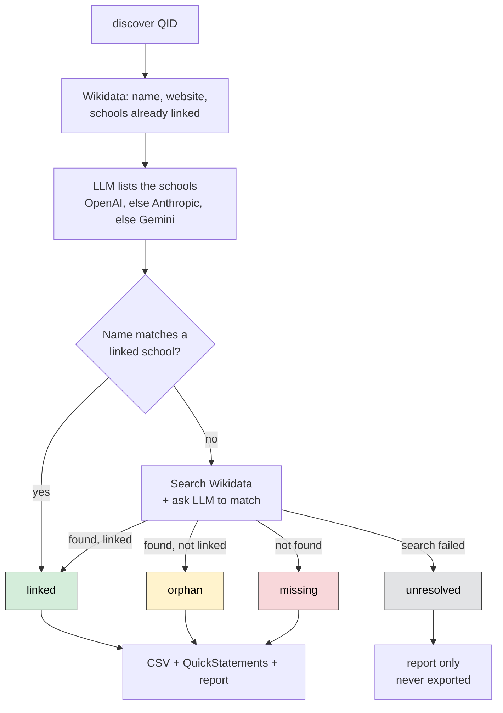
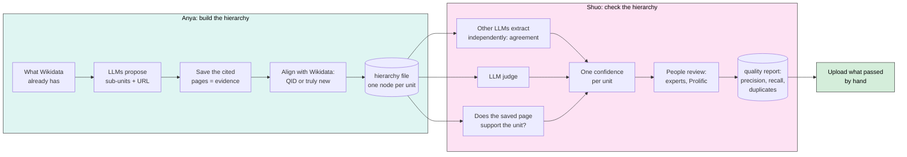

# TASKS.md

**Goal.** Build the structure of every U.S. university (university, then school, then
department) as a hierarchy we keep offline, aligned with Wikidata, with evidence for every
unit. Then measure how good that hierarchy is, with other LLMs, with the evidence, and with
people. Only what passes goes to Wikidata, by hand, at the end.

This file is the plan. It is written for two students, Anya and Shuo, who direct a coding
agent rather than write most of the code. Read it top to bottom once. Come back to your
track every week. If a word is unfamiliar, see the glossary at the end.

Last updated: 2026-10-03

---

## 1. What exists today

The code can do one thing well: **given a university, find its schools and colleges.**

```
python -m wikidata_discover.scripts.wikidata_division_discover discover Q49210
```

That command (Q49210 is NYU):

1. Looks up the university on Wikidata: name, website, and the schools already linked to it.
2. Asks an LLM to list the university's schools. It tries OpenAI first (with web search).
   If that fails, it tries Anthropic, then Gemini (without web search).
3. Checks each school the LLM named against what Wikidata already has. First by comparing
   names, then by asking an LLM when names are close but not identical.
4. Labels each school: already linked, exists but not linked (an "orphan"), or missing.
5. Writes the results to `wikidata_discover/results/`: a CSV, a QuickStatements file that
   could create the missing schools, and a small JSON report.



**How good is it?** We built the true list of schools for 12 universities by hand
(`wikidata_discover/eval/ground_truth.py`) and measured. The best setup, Anthropic judging
a merged list from OpenAI and Gemini, gets about 95% precision and 95% recall. The numbers
are in `wikidata_discover/eval/results_summary.csv`. Rerun with:

```
python -m wikidata_discover.eval.run_eval
```

All 12 are large, well-known universities. The research literature says LLMs do much worse
on less-known entities and on deeper levels of a hierarchy (see `docs/LITERATURE.md`), so
expect lower numbers for small colleges and for departments.

**School-level data for 1,519 universities is already collected.** The cloud run
`us-tier1` (in the bucket under `runs/us-tier1/`, finished 2026-10-03) ran `discover` on
1,519 U.S. universities. It proposed 9,190 schools: 2,327 already linked on Wikidata, 450
orphans, 6,413 "missing". Almost all answers came from OpenAI alone. 15% of the proposed
rows have no source URL.

A spot check of 40 random "missing" schools (2026-10-03, by hand plus Wikidata full-text
search) shows why that run is a starting point and not a result:

- At least 5 of the 40 already exist on Wikidata. Example: "Wheelock College of Education &
  Human Development" is Q4948183, labeled "Boston University Wheelock College of Education &
  Human Development". The pipeline's search did not find it. Creating it again would make a
  duplicate.
- One of them (Kent State Geauga) is already on Wikidata twice (Q61931599 and Q100993336).
- About 7 are not academic units: "Career Services", "Division of Student Affairs",
  "Academic Support Services".
- 3 are campuses, which our modeling rules do not yet cover.

So the two jobs this semester are the two halves of fixing that: **build** a hierarchy that
does not create duplicates and has evidence for every unit (Anya), and **check** it well
enough to know which parts are right (Shuo).

**What does not exist yet:**

- A hierarchy file. Today each run writes flat CSVs per university. (Anya, week 5.)
- A record of what was asked and what came back: raw responses, prompts, pages fetched.
  The LLM's cleaned-up answer is cached in `wikidata_discover/results/cache/`, nothing
  more. (Anya, week 2.)
- Saved copies of the pages the LLMs cite. (Anya, week 4.)
- Departments. The code only goes one level down. (Anya, weeks 4 to 5.)
- A search that finds existing Wikidata items under a different label. (Anya, week 6.)
- Web search for Anthropic and Gemini. They answer from memory, so the URLs they cite may
  not exist. (Anya, week 4.)
- Any check that a cited page says what the LLM claims, any measure of agreement between
  providers, any human review. (Shuo, weeks 3 to 9.)
- Nothing has been uploaded to Wikidata. (Both, week 10.)

**Collecting many universities at once.** The batch runner resumes where it stopped and
uploads every output to the `academiabot` bucket under `runs/<run_id>/`. It runs from a
terminal (`python -m wikidata_discover.scripts.batch_collect <run_id> <QID> ...`) or as a
Cloud Function called every 30 minutes by Cloud Scheduler. How to deploy, start, stop, and
watch a cloud run is in AGENTS.md ("Running collection in the cloud"). Only Panos starts a
cloud run, because it spends LLM credit.

Where the project came from and why we model things the way we do: `docs/BACKGROUND.md`.
What the research literature says about each step, with references: `docs/LITERATURE.md`.
Read both once.

---

## 2. The two streams



**Anya's output: the hierarchy file.** One file per university. One node per unit. Every
node has:

- a stable id of our own (the same unit gets the same id on every run),
- a name, other names it goes by, and a type (school, department, program, center, other),
- its parent or parents (a list, because joint departments have two), and for each parent
  whether Wikidata already has that link,
- its Wikidata QID, or none,
- an alignment status: **linked** (QID exists and Wikidata already has P749 from it to the
  parent), **orphan** (QID exists, but no P749 to the parent; a unit connected only through
  "part of", "has part" or similar is an orphan too, so the export adds the P749), **new**
  (no item on Wikidata; we looked hard), or **uncertain** (we could not decide; never
  exported),
- the Wikidata items considered when aligning it, and why one was chosen or none,
- the evidence: the source URL, and a saved copy of the page with the date it was fetched,
- which run and which LLM calls proposed it.

The exact field list is in AGENTS.md ("Hierarchy file").

**Shuo's output: checks, reviews, and a quality report.** Every check on a unit is one row
in a `checks` table (which providers named it, what the judge said, whether the page
exists, whether it supports the unit). Every human verdict is one row in a `reviews`
table. Neither table is ever overwritten. From these, a quality report per run: precision
by level with a confidence interval, an estimate of recall, the share of cited pages that
support their unit, and the duplicate rate.

**Each student also owns two small research questions** (section 8). They are built into
the weeks below, so the measurements happen as a side effect of the work.

---

## 3. How we work

You direct a coding agent (Claude Code or similar). The agent reads `AGENTS.md` for the
rules of this codebase and reads this file for what to do. You do the part the agent
cannot do:

- **Say exactly what to build.** Name your track and the week. Give the agent the
  "you check it by" line from your table. That is the test it must pass.
- **Check the result on data you chose.** Run the command. Open the file. Count the rows.
  Never accept "done" without seeing it work.
- **Judge the data.** Is this really a department? Is this URL really the right page? The
  agent guesses. You know, or you find out.
- **Own what goes into Wikidata.** The agent never uploads. A person does, after review.

Rules that keep things manageable:

1. One week of work per branch and pull request. Small steps.
2. Ask the agent for a short plan before it writes code. Read it. Push back if it is
   doing more than the week asks.
3. If the agent says tests pass, run them yourself: `python -m pytest tests -q`.
4. At the end of each session, have the agent tick your boxes in this file, add anything
   it learned to `AGENTS.md`, and summarize the change in the pull request.
5. Keep a short log for Panos: date, what you tried, what worked, what you decided.
6. Weekly meeting: bring the deliverable in the right-hand column of your table.
7. Every number you report says what it was measured on (how many units, which
   universities) and, from week 5 on, comes with a confidence interval.

---

## 4. Week 1 for both of you (Oct 2 to 8): get set up

- [ ] Ask the agent to install dependencies and run the tests. All should pass (142 today).
      The cloud tests need `wikidata_discover/cloud/requirements.txt` installed too.
- [ ] Get API keys working. Today the code reads keys only from `.env`: copy `env.example`
      to `.env` and paste at least one key (ask Panos). Never commit `.env`. After Anya's
      week 2 lands, the keys will come from Secret Manager and `.env` becomes optional.
- [ ] Run discovery on NYU (Q49210). Open `wikidata_discover/results/reports/Q49210_report.json`.
      (NYU's schools are all linked already, so no CSV is written for it. A university with
      missing schools also gets a CSV and a QuickStatements file.)
- [ ] Run it on a university you know well. Is the list of schools right? Note what is wrong.
- [ ] Open 10 rows of the `us-tier1` results in the bucket (`runs/us-tier1/missing_divisions_*.csv`),
      from universities you have never heard of. For each "missing" school, search Wikidata
      by hand. Is it really missing? Is it really a school?
- [ ] Ask the agent to walk you through the pipeline using `discovery.py` as the guide.
      Then ask it the question that confused you most.
- [ ] Run the evaluation and compare its numbers to `wikidata_discover/eval/results_summary.csv`.
- [ ] Read `docs/BACKGROUND.md`, and in `docs/LITERATURE.md` the part for your stream.
- [ ] Write one paragraph for Panos: what the pipeline does, and one thing you would change.

---

## 5. Anya's track: build the hierarchy

Your question for the semester: **can the code build each university's hierarchy so that
every unit either points to the right Wikidata item or is truly new, and say where each
unit came from?**

| Week | Dates | You ask the agent to build | You check it by | You do yourself | Hand to Panos |
|---|---|---|---|---|---|
| 2 | Oct 9 to 15 | **Record everything.** A run log in BigQuery with four tables: `runs` (one row per command run), `llm_calls` (every prompt and raw response), `evidence` (every web page fetched), `candidates` (every unit proposed, with links to the calls and pages that produced it). Big text goes to Cloud Storage; the row keeps the path. Local JSON files when GCP is unreachable. Also: `config.py` reads API keys from Secret Manager when `.env` has none. | Running discovery on NYU twice. Both runs appear in BigQuery. Open one raw LLM response in Cloud Storage and find a school name in it. Delete `.env`, run again: it still works. Then make the cloud writer fail (for example, point it at a bucket that does not exist) and run again: the run, calls, evidence, and candidates must all be in `wikidata_discover/results/runs/`. | Decide what one `candidates` row must contain so that Shuo can check it later without asking you. Write that list down and give it to Shuo. | The table schema, one page, and a screenshot of a real run in BigQuery. |
| 3 | Oct 16 to 22 | **What Wikidata already has, and what is missing.** A `snapshot <QID>` command that saves a university's whole subtree as Wikidata has it today: every unit below it through P749, P361, P527, P355, P199, with labels, other names, P31, website (P856), ROR id (P6782), and parents. A one-time import of the `us-tier1` results into `candidates`. A gap report over the 1,519 universities: per university, units on Wikidata, units the LLM proposed, how many linked, orphan, missing, and how many units the old crowd table (`docs/BACKGROUND.md`) has, where it has the university. | For NYU, compare the snapshot with the second query in section 11 (every unit below the university, through the same five properties), run by hand: the same units. Then pick 5 units and compare the snapshot with each one's Wikidata page: other names, P31, website, ROR id, and parents must all match. Take 20 random "missing" schools from the gap report and search Wikidata for each by hand, also trying "university name + school name". Write down how many already exist and how many are not schools at all. That count is the baseline for week 6. | Read the gap report. Pick the 5 universities with the biggest gap between Wikidata and the LLM, and check two of them by hand: who is right? | The gap report, and your baseline: of 20 "missing", how many were not missing, and how many were not schools. |
| 4 | Oct 23 to 29 | **Departments, with evidence.** The LLM step takes any unit (a university or a school) and returns its sub-units. Each comes with a name, a type (department, program, center), a website if known, and **one source URL**. Web search or grounding turned on for Anthropic and Gemini too. Every cited page is fetched once and saved: HTTP status, final URL after redirects, content hash, page text, all in the `evidence` table and linked to the candidate. A unit without a URL is kept and flagged. The URLs come from an LLM, so the fetcher only follows `http` and `https`, refuses any address that is not public (localhost, private networks, cloud metadata) on the first request and on every redirect, and stops after 5 redirects, 5 MB, or 20 seconds. A refused URL is recorded as refused. | Running it on the three NYU schools in Shuo's ground truth (Stern, Courant, Steinhardt) and scoring with Shuo's scorer. Open 5 saved pages and find the unit's name in each. Give it one dead URL on purpose: it must be saved with its status, not crash the run. Give it `http://localhost/`, `http://169.254.169.254/`, and a public URL that redirects to one of them: all three refused, nothing fetched from them. | Agree with Shuo on what counts as a department. Write the answer in `docs/MODELING_RULES.md`, starting with the easy cases. Add campuses and administrative offices (career services, student affairs): the spot check found both in `us-tier1`. | Department lists for the three schools, with the score for each. |
| 5 | Oct 30 to Nov 5 | **The hierarchy file.** `discover --depth 2` writes one hierarchy file per university (format in AGENTS.md): one node per unit with a stable id, parents and whether each link exists on Wikidata, QID or none, alignment status, evidence, and the run and calls that proposed it. Every in-scope unit from the week 3 snapshot goes in too, even if no LLM named it, and gets its departments looked up like any other. Ids come from a register that keeps a unit's id when it is renamed, moved, or later matched to a QID. The same nodes go into a `nodes` table in BigQuery. Every level is written to the run log. | Running `discover --depth 2 Q49210`. Open the file. Pick 10 departments at random: right school? right type? QID right or rightly empty? Every node has a source URL or a flag. Every school in NYU's snapshot is in the file and has departments looked up, including one you remove from the LLM's answer by hand. Run it a second time: the same unit gets the same node id. Rename one unit and give another a QID, run again: both keep their ids. | Note every oddity: a department under two schools, two departments with the same name, a "school" that is really a program, one unit under two names. These feed weeks 6 and 7. | NYU's hierarchy file, your list of oddities, and the midpoint report: cost and time per university, share of units with a saved page. |
| 6 | Nov 6 to 12 | **No duplicates.** Before calling a unit "new", search harder: full-text search, not only label prefix (the prefix search missed "Boston University Wheelock College..."); the name with the university's name in front; other names and abbreviations; the website domain (P856); items whose parent is any unit already in the tree. Then an LLM picks one of the candidates or none (choose from the list, not yes or no per item). Inside our own tree, merge nodes that are the same unit under two names. When Wikidata itself has two items for one unit, flag it for a person and never merge it ourselves. Every node records the candidates looked at and the reason for the choice. Behind a flag, a second way to decide: ask yes or no for each candidate separately. It is the baseline for research question A1. | Shuo's ground truth has a QID column: every unit with a QID must now be linked to that QID. Count the misses. Run the 20 schools from your week 3 baseline again: how many now get the right QID? Run NYU twice: the second run adds no nodes. | Research question A1 (section 8): label 150 units from `us-tier1` by hand with the right QID or "none": 100 that it called missing and 50 that it called linked or orphan. Measure, before and after, the false-new rate (on units that do have a QID) and the false-link rate (on units given a QID), and which search found each one. Run both ways of deciding (choose from the list, yes or no per candidate) on the same 150 units. | False-new and false-link rates before and after, per kind of search and per way of deciding, on your 150 labels, reported per stratum (called missing, called linked or orphan) and overall with each stratum weighted by its share of `us-tier1`. |
| 7 | Nov 13 to 19 | **The messy cases.** Code that follows `docs/MODELING_RULES.md`: joint departments get two parents (with the rank and qualifiers the rules set for each link), same-name departments stay separate, renamed units are handled the way the rules say, campuses and offices are handled the way the rules say. One test per rule. | Feeding it the oddities from week 5. Each must come out the way the rules say. | Finish `docs/MODELING_RULES.md` with Panos: at least 5 real cases, each with the decision and the reason. | The rules doc and the passing tests. |
| 8 | Nov 20 to 26 | **Twelve universities.** An `--extract` flag that picks the extraction setup (one provider, or two generators and a judge). Set it to the setup Shuo chose at the end of week 6, then run depth 2 on all 12 ground-truth universities, written to the run log, with a summary table per university. Light week, Thanksgiving. | Picking one university and recounting its summary row by hand from the hierarchy file. Re-running one university: the cache must make it fast and the numbers identical. | Hand the run ids to Shuo. | The 12 hierarchy files and the summary table. |
| 9 | Nov 27 to Dec 3 | **A correct export.** The QuickStatements exporter reads the hierarchy file and the `reviews` table. It links with P749 (not P361), puts a reference on every statement (source URL and the date it was retrieved), writes one file per level, and handles each status: **new** gets the minimum statement set (P17 from the node's own country, never assumed from the university: NYU Abu Dhabi is not in the U.S.), **orphan** gets only the missing P749s, with the rank and qualifiers `docs/MODELING_RULES.md` sets for joint units, **linked** gets no statement, **uncertain** is never exported. A "fix" verdict is never exported directly: the correction is applied to the hierarchy file (a corrected source URL goes through the fetcher first), which makes a new node version, and that version needs its own accept. Which verdicts authorize a unit (how many accepts, whether any reject blocks it, experts only or not) is read from `review_protocol.json`, so the rule Shuo writes in week 10 is the rule the export applies; until then the default is one blind expert accept and no reject. Next to each QuickStatements file it writes a manifest: for every statement, the node_id, node_version, and review ids that authorize it, and for every in-scope node of that level not exported, the reason (already linked, rejected, uncertain, not enough verdicts, parent not yet uploaded). It refuses any unit without a human verdict on its current version: a verdict given to an earlier version of the unit (different name, parent, QID, alignment candidates, or evidence) does not count. A joint unit gets one P749 for each parent link that is missing. A department whose parent school is new is held back: after the school file is uploaded, an `ingest-qids` command records the schools' new QIDs (each confirmed by a person), and only then is the department file written. | Pasting the file into the QuickStatements web tool in preview mode (do not run). Every statement shows a reference. Mark 3 rows reject, 1 row fix with a corrected name, and 1 row fix with a corrected parent. Export again: the 3 must be absent; the 2 must be held back until you accept their new versions, then carry the corrections. Give one row an accept and a second reviewer's reject: refused under the default rule. One new unit outside the U.S. gets its own country in P17; one joint unit gets two P749s with their qualifiers. Linked units appear in the manifest as "already linked". Remove one verdict: the export must refuse that row. Open the manifest next to the export: one line per statement with its node and version. | Read every line of the NYU export. | The NYU export file, previewed and accepted by the tool. |
| 10 | Dec 4 to 10 | First, fixes the upload needs. Then **page first**, for research question A2: an `--extract page-first` mode that finds the unit's own page listing its sub-units (on the unit's website, else by search), saves it, and extracts units from the saved text only, each citing that page. | Re-running the week 5, week 6, and week 9 checks. On Stern in page-first mode, every unit cites the one saved page and its name appears in that page's text. Then run both modes on the 6 ground-truth schools and score them, and run Shuo's verifier on both. | **First upload**, with Shuo and Panos: pick the university whose quality report is best. First rerun alignment for it against today's Wikidata (an editor may have created a "new" unit or added a link since week 8); anything that changed gets a new version. Then Shuo and you review every school of it on its current version, because earlier verdicts may be on older versions and the export refuses those. Export the schools, review every line, upload under your own Wikidata account, record the batch id here, and run `ingest-qids`. That gives departments under new schools a new version, so review the departments only now, then export and upload them the same way. Query Wikidata back with the SPARQL in section 11. Only if it meets the bar in Shuo's `docs/REVIEW_PROTOCOL.md`. | Departments of one university live on Wikidata, or a written reason why not yet. |
| 11 | Dec 11 to 17 | Cleanup. All tests pass. Boxes ticked in this file. | Running the tests yourself. Reading this file: does it say what was done? | Write your final report, with a two-page note on A1 and A2. | Report: what the pipeline can do, its numbers, cost per university, the false-new rate, and what the next person should do first. |

**Done when:** `discover --depth 2` writes a hierarchy file for 12 universities, every
unit has a saved source page or a flag, every unit is linked, orphan, new, or uncertain
for a recorded reason, the false-new rate is measured, the export is correct and
referenced, and one university's departments are live on Wikidata.

**If something is late.** Week 4 needs Shuo's ground truth for the three NYU schools (Shuo's
week 2). If it is late, build the Stern list yourself from the Stern website. Week 8 needs
Shuo's choice of extraction setup (Shuo's week 6). If it is late, use Anthropic judging
OpenAI plus Gemini, the best setup at the school level.

---

## 6. Shuo's track: check the hierarchy

Your question for the semester: **for every unit in the hierarchy, how sure are we that it
is right, and which checks are worth what they cost?** Four kinds of check, built in this
order: other LLMs extract the same list independently and we count agreement, an LLM
judge reviews the merged list, the saved page is checked against the claim, and a person
gives a verdict. Nothing enters Wikidata without the last one.

| Week | Dates | You ask the agent to build | You check it by | You do yourself | Hand to Panos |
|---|---|---|---|---|---|
| 2 | Oct 9 to 15 | **A scorer.** Loads a department ground-truth CSV (one row per department: parent, name, type, `source_url`, `qid`) and scores any list against it: precision and recall on names, and alignment accuracy on QIDs (right QID, or rightly "new"). When parents are given, also edge F1 (right parent) and ancestor F1 (right university). | Feeding it your own ground-truth list plus 2 made-up department names: recall 100% and exactly 2 wrong names (precision = N/(N+2) for N real names). Remove 1 real name: recall must be (N-1)/N. Change one QID: alignment accuracy drops by exactly 1/N. | Build the ground truth for Stern, Courant, Steinhardt from their websites, one URL per department. For each, search Wikidata by hand and write the QID, or write "none" if you looked and found nothing. Start from the old BigQuery table (`docs/BACKGROUND.md`) but confirm every row yourself. | Ground-truth CSV, about 40 to 60 rows, every row with a URL you visited and a QID column. Give it to Anya. |
| 3 | Oct 16 to 22 | **Parallel extraction: do independent LLMs agree?** Each provider lists the schools of the 12 eval universities on its own, 3 runs each, through the existing extractors. Each run gets a sample number that is part of its cache key, so the three runs are three real calls (not one call read back from the cache three times) and a rerun replays the same three answers. Name variants of one school are grouped ("Dept. of CS" and "Computer Science"). For each school proposed, one row in a new `checks` table: how many providers and runs named it. Plus a table: precision at each agreement level, and how often provider B names a wrong school when provider A did. Plus research question S1 (section 8): from the overlap between providers, estimate how many schools each university has, and compare with the true count. | Running it twice: identical numbers (the cache works). The cache folder has 3 files per provider and university, not 1. Recounting two universities by hand from the raw lists. | Build a school-level ground truth for 6 small universities from `us-tier1` (ones you had never heard of), because the 12 we have are all famous. Read 20 schools named by only one provider: real or not? | The agreement table, and the first recall estimate next to the true count. |
| 4 | Oct 23 to 29 | **The LLM judge, tested.** Each provider takes a turn as judge of the merged list. Each judge runs four times: twice with the list in one order and twice in another (each call its own cache entry, as in week 3). Report: how often a verdict flips between two runs in the same order (ordinary randomness) and between orders; the order effect is the difference, whether a judge keeps its own provider's schools more often than others' at the same correctness, and whether the judge's gain is in precision (removing wrong ones) or recall (keeping right ones). Then the same on departments for the three NYU schools, from Anya's week 4 output. | One hand-made list with 3 fake schools added: does each judge remove them? The order test runs on all 12 universities and reports both flip rates, same order and different order. | Extend the department ground truth to three schools outside NYU: one at a large public university, one at Howard, one at a small college. Same columns. | The judge table, and the department ground truth for 6 schools. |
| 5 | Oct 30 to Nov 5 | **Does the page exist and name the unit?** Over Anya's `evidence` table: dead links, pages that say "not found" with status 200, pages off the university's domain, and whether the unit's name appears on the page (allowing small differences). Run Anya's week 4 fetcher over the URLs each provider cited in your week 3 lists first, so every provider has saved pages to count. Also on 300 random school URLs from `us-tier1` (almost all OpenAI, reported separately). Each result is a row in `checks`. | Giving it 10 URLs you picked: 2 dead, 2 real but about something else, 6 correct. It must sort all 10 the way you did. | Label 100 claim-and-page pairs yourself ("X is a department of Y", and the saved page): supported, not supported, or unclear. Read 20 failures and sort them: dead link, wrong page, right page but different name, made-up URL. | Midpoint report: share of cited URLs that exist and support the unit, per provider (from the week 3 lists, where all three providers answered the same questions), with confidence intervals; the agreement and judge tables. |
| 6 | Nov 6 to 12 | **LLM verifier.** Given a claim and the saved page, answer supported, not supported, or unclear, and quote the sentence that decides it. If the quote is not in the saved page word for word, the answer becomes unclear. Run it with one provider's model and, for cost, with one small checker (MiniCheck). MiniCheck answers only supported or not, with a probability, and gives no quote, so it is scored as a yes-or-no checker. | Compare the LLM verifier with your 100 labels: accuracy and the three-way confusion matrix. Compare MiniCheck with the same labels collapsed to two (supported against everything else), and the LLM verifier collapsed the same way, so the two are compared on equal terms. Spot-check 10 LLM quotes against the page. | Decide what verifier accuracy is good enough to sort the review sheet by. Choose the extraction setup for departments (which generators, which judge) from weeks 3 to 6. Give the choice to Anya. | Verifier accuracy with the confusion matrix, and the setup choice with the numbers behind it. |
| 7 | Nov 13 to 19 | **One confidence per unit, and a review sheet.** Combine the checks into one confidence per node of a hierarchy file (start with a simple rule, such as "all providers agree and the page supports it" = high). A `review` command that writes one row per node: parent, name, type, QID or new, the Wikidata items Anya's alignment considered, source URL. Two passes: in the first, rows are in random order and the checks and confidence are hidden, and the reviewer records a verdict; only then are the checks shown, sorted doubtful first, and the reviewer may record a second verdict. Columns to fill: `verdict` (accept, reject, fix), one correction column per field a reviewer can fix (`fix_name`, `fix_type`, `fix_parent`, `fix_qid`, `fix_website`, `fix_source_url`), and `notes`. An accept or fix needs a `url_checked` of yes: the reviewer opened the source page and it supports the unit. Each verdict is saved as its own row in the `reviews` table (one per reviewer per unit), never overwriting another reviewer's, and records the run and the node version it was given (see AGENTS.md), plus which pass it was and a hash of the whole row as shown, so a verdict always says exactly what the reviewer saw. | Marking 3 rows reject and 2 fix (one name, one parent and QID together), saving, re-opening: the verdicts and each corrected field persist. A second reviewer's verdict on the same row is a new row. Change one reviewed unit's source URL in a later run: its old verdict no longer counts for it, and it shows up again as unreviewed. | Review NYU's sheet (Anya's week 5 file), timed. Panos reviews the same sheet independently. Compare every disagreement. Did low confidence predict your rejects? Answer this from the first-pass verdicts only, given before you saw the confidence. | `docs/REVIEW_GUIDE.md`, one page, written from the disagreements; your agreement with Panos; how well the confidence predicted your verdicts. |
| 8 | Nov 20 to 26 | **A Prolific task, ready to launch.** One unit per item: its parent, its name, and the saved page as a picture (not copyable text). Answer accept, reject, or fix. The worker judges only the claim and the page ("this page shows X is a unit of Y"); whether the QID or "new" is right stays with experts, because it needs Wikidata searching that a short paid task cannot ask for. One qualification question. Gold items made by corrupting units you checked (wrong parent, a fake unit, the wrong page). Two versions, assigned at random: one shows the verifier's answer, one does not. The instructions ask workers directly not to use AI tools. A script that computes agreement with your verdicts. Light week, Thanksgiving. | Doing the task yourself as a worker. Ask Panos to do 10 items. Fix any instruction that confused either of you. | Write 20 gold items. | The task, ready to launch. |
| 9 | Nov 27 to Dec 3 | **Prolific pilot, and the quality estimate.** Launch on a random sample of about 150 units from Anya's 12-university run, 3 workers per unit in the version that hides the verifier's answer, plus a second set of workers on the same units in the version that shows it. Analysis: worker accuracy against your blind verdicts on all 150; Dawid-Skene against simple majority; the effect of showing the verifier's answer. Research question S2 (section 8): precision of all 12 hierarchies estimated from the human sample alone, and from the human sample plus verifier labels on every unit. This precision is about the claims (is it a real unit of that parent); the accuracy of QIDs and "new" comes from your blind expert verdicts on the same 150, which check alignment too. Only verdicts from the version that hides the verifier's answer go into these estimates; the other version is used only to measure anchoring. | Recomputing one reported number by hand from the raw rows. | Before launch, give your own blind verdict on all 150 sampled units, including their QID or "new". These are the expert labels that worker accuracy is measured against. Then read every unit where workers disagreed. Budget guide: about 20 cents per unit in the old project. | Pilot report: accuracy, cost and time per unit, the anchoring effect, a go or no-go on scaling, and precision with its interval both ways. |
| 10 | Dec 4 to 10 | **Pre-upload check.** A command that reads an export file and its manifest, and checks them against the hierarchy file and the `reviews` table. It refuses the file if any statement lacks a reference, has no manifest line, or has no accepting verdict on the node's current version, or if an in-scope node is missing from both the file and the manifest's list of nodes left out. | Removing one verdict and running it: refused. Restoring it: accepted. Setting one accepting verdict's `url_checked` to no: refused. Deleting one statement's manifest line: refused. Deleting a node from both the file and the manifest: refused. | Write `docs/REVIEW_PROTOCOL.md`: who reviews what, how many reviewers, what agreement is needed, and the minimum estimated precision for a university to be uploaded. Before the first upload, review every unit of the chosen university on its current version, with Anya: schools first, departments after `ingest-qids` (Anya's week 10). **First upload**, with Anya and Panos. Watch the uploaded items: if a Wikidata editor changes anything, find out why. | The protocol, and the first referenced, human-verified batch live on Wikidata. |
| 11 | Dec 11 to 17 | Cleanup. All tests pass. Boxes ticked in this file. | Running the tests yourself. Reading this file: does it say what was done? | Write your final report, with a two-page note on S1 and S2. | A quality report for the 12 universities (precision by level with intervals, estimated recall, page-support rate, duplicate rate), what each check costs and what it catches, and what the next person should do first. |

**Done when:** every unit in the 12-university run has its checks recorded, the review
process runs from the two docs alone, the quality report has intervals, and every
statement in the first upload has a URL a person checked.

**If something is late.** Week 4's department part needs Anya's week 4 output. If it is
late, do schools only that week and departments in week 5. Week 7 needs Anya's hierarchy
file (Anya's week 5). If it is late, build the sheet from the run log's `candidates` rows
and switch later. Week 9 needs Anya's 12-university run (Anya's week 8). If it is late, run
the pilot on the NYU hierarchy.

---

## 7. Where the two tracks meet

| When | From | To | What |
|---|---|---|---|
| End of week 2 | Shuo | Anya | Ground truth for Stern, Courant, Steinhardt, with QIDs |
| End of week 2 | Anya | Shuo | What a `candidates` row contains |
| End of week 3 | Anya | Shuo | `us-tier1` in the run log, and the gap report |
| End of week 4 | Anya and Shuo | each other | `docs/MODELING_RULES.md`, first version |
| End of week 4 | Shuo | Anya | Department ground truth for 3 more schools |
| End of week 4 | Anya | Shuo | Department candidates with saved pages for the ground-truth schools, and the page fetcher (Shuo runs it on the week 3 lists) |
| End of week 5 | Anya | Shuo | NYU's hierarchy file (Shuo's review sheet, week 7) |
| End of week 6 | Shuo | Anya | Which extraction setup to use (Anya's week 8) |
| End of week 8 | Anya | Shuo | Run ids for the 12 universities |
| Week 9 | Shuo | Anya | Verdicts in the `reviews` table, which the export must honor |
| Week 10 | Both with Panos | Wikidata | The first upload, if it meets the protocol |


Meet together with Panos once a week. Meet each other whenever a hand-off is due.

---

## 8. Research questions

Each student owns two small questions. Each takes a few weeks of measurement on data the
pipeline produces anyway, and each is something the literature has not settled for our
kind of data. References and the full reasoning are in `docs/LITERATURE.md`. Write each up
as a two-page note in week 11: question, data, method, result, what we changed because of it.

### Anya

**A1. How often is a "new" unit already on Wikidata, and what finds it?** (weeks 3 and 6)
Our spot check found at least 5 existing items among 40 "missing" schools. Studies of
LLM-built knowledge bases find that only about a quarter of generated entities have an
exact-label match on Wikidata (Hu et al., GPTKB), and that entity linkers mostly ignore
types, parents, and other structure (Möller et al.). Measure on 150 hand-labeled units, drawn from every status so both rates have a
denominator: the false-new rate (we would create a duplicate) and the false-link rate (we
would attach the wrong item), for each search method in week 6, and whether choosing from a candidate
list beats a yes or no per candidate (Wang et al., COLING 2025). This is the number that
decides whether Wikidata editors will trust our uploads.

**A2. Ask and cite, or read the page?** (week 10) Today the LLM lists units and cites a URL
for each. Generative search engines cite pages that fully support the claim only about
three quarters of the time (Liu, Zhang, Liang 2023). The alternative is to find the
school's own "departments" page first and extract units from its saved text, so the
evidence exists before the claim. Compare the two on the 6 ground-truth schools:
precision, recall, share of units whose page supports them (Shuo's verifier), cost. A
recall-then-verify design is what the closest published system does (Singhania et al.,
"Recall Them All").

### Shuo

**S1. Can we estimate recall without ground truth?** (weeks 3 to 5) For the 1,519
universities we will never have a hand-built list. If two providers find units
independently, the overlap between their lists estimates how many units exist (capture
and recapture, as ecologists count fish). But LLMs make correlated errors (Kim et al., ICML
2025: when two models both err they agree about 60% of the time), so they tend to miss the
same obscure units and the estimate will come out too low. Measure on the 12 famous plus 6 small
universities: the estimate against the true count, for two providers, three, and repeated
runs of one, and how much the correlation biases it. Crowdsourced enumeration work
(Trushkowsky et al. 2013) is the closest prior work.

**S2. How few human labels can certify the hierarchy?** (weeks 8 and 9) Checking every
unit by hand does not scale. Prediction-powered inference (Angelopoulos et al., Science
2023) gives a valid confidence interval for precision from a small random human sample
plus cheap verifier labels on everything, and it gets tighter the better the verifier is.
Here it estimates the precision of the claims (each unit is real and belongs to its parent);
the accuracy of QIDs is measured separately on the expert-labeled sample.
Measure: for 50 to 150 human labels, the interval width with and without the verifier
labels, and how many labels are needed for plus or minus 3 points. Only verdicts given
without seeing the verifier's answer may enter this estimate, or the verifier's errors
would come back as human agreement. A second question, cheap to add to the same pilot:
do reviewers who see the verifier's answer simply copy it? Studies of LLM-assisted
annotation find they largely do (Schroeder et al. 2025), which would make our precision
look better than it is.

**If a question finishes early,** good next ones: does web search help most for small
universities (Mallen et al. 2023 predicts yes); edge F1 against ancestor F1 at the
department level (is the error wrong parents or missing units); a calibrated threshold that
lets high-confidence units skip human review (conformal factuality, Mohri and Hashimoto
2024).

---

## 9. Stretch goals (after week 11)

Pick one. Same shape as everything above: you define the rule and check the data, the
agent builds the code.

- **Departments at scale.** Run depth 2 over the `us-tier1` list with the batch runner,
  using the setup from week 8 and the alignment from week 6. One combined review sheet,
  sorted by confidence.
- **Faculty linking.** For one department, find the faculty page, extract names and
  titles, match them to existing Wikidata people and ORCID records, link with P108
  (employer). One department first.
- **Review at scale.** If the Prolific pilot says go: a Prolific task per batch, several
  reviewers per row, agreement recorded with every upload.
- **Beyond the U.S.** Make the country a parameter of `harvest`.

---

## 10. Parked (not now)

Good ideas that are not the bottleneck. Do not start them unless Panos asks.

- Direct Wikidata API writes with a bot account (needs Wikidata bot approval).
- Salary data for public-university faculty.
- Packaging as an installable command, continuous integration, type checking.
- Reconciling the IPEDS institution list against Wikidata.
- Merging duplicate items that are already on Wikidata. We flag them; editors merge.

---

## 11. Reference: useful SPARQL queries

Paste these into https://query.wikidata.org.

```sparql
# All children of a university (NYU here)
SELECT ?child ?childLabel ?childTypeLabel WHERE {
  ?child wdt:P749 wd:Q49210 .
  OPTIONAL { ?child wdt:P31 ?childType . }
  SERVICE wikibase:label { bd:serviceParam wikibase:language "en". }
}
```

```sparql
# Every unit below a university (NYU here), at any depth, through the same five
# properties the crawler follows. This is what a week 3 snapshot must contain.
SELECT DISTINCT ?unit ?unitLabel WHERE {
  wd:Q49210 (wdt:P527|wdt:P355|wdt:P199|^wdt:P361|^wdt:P749)+ ?unit .
  SERVICE wikibase:label { bd:serviceParam wikibase:language "en". }
}
```

```sparql
# Departments with no parent organization (orphans). Both department classes we use.
SELECT ?dept ?deptLabel WHERE {
  VALUES ?deptClass { wd:Q1183543 wd:Q2467461 }
  ?dept wdt:P31 ?deptClass .
  FILTER NOT EXISTS { ?dept wdt:P749 ?parent }
  SERVICE wikibase:label { bd:serviceParam wikibase:language "en". }
}
```

```sparql
# How many schools and departments each U.S. university has.
# Same university predicate as the harvester (subclasses of university included).
SELECT ?univ ?univLabel (COUNT(DISTINCT ?school) AS ?nSchool) (COUNT(DISTINCT ?dept) AS ?nDept)
WHERE {
  VALUES ?deptClass { wd:Q1183543 wd:Q2467461 }
  ?univ wdt:P31/wdt:P279* wd:Q3918 ; wdt:P17 wd:Q30 .
  OPTIONAL { ?school wdt:P749 ?univ ; wdt:P31 wd:Q31855 .
    OPTIONAL { ?dept wdt:P749 ?school ; wdt:P31 ?deptClass . }
  }
  SERVICE wikibase:label { bd:serviceParam wikibase:language "en". }
}
GROUP BY ?univ ?univLabel
ORDER BY DESC(?nDept)
```

```sparql
# Full-text search for an existing item, which finds labels that do not start with the
# name you typed ("Boston University Wheelock College..." for "Wheelock College").
SELECT ?item ?itemLabel ?itemDescription WHERE {
  SERVICE wikibase:mwapi {
    bd:serviceParam wikibase:endpoint "www.wikidata.org"; wikibase:api "Search";
                    mwapi:srsearch "Wheelock College Boston University"; mwapi:srlimit "10".
    ?item wikibase:apiOutputItem mwapi:title.
  }
  SERVICE wikibase:label { bd:serviceParam wikibase:language "en". }
}
```

---

## 12. Glossary

- **Wikidata.** A free database of facts that Wikipedia and many others read from. Anyone
  can edit it. We are adding to it.
- **QID.** Wikidata's id for a thing. NYU is Q49210. Stern is Q770467.
- **Property.** Wikidata's name for a kind of fact. P749 means "parent organization".
  P31 means "is a". The ones we use are listed in `AGENTS.md`.
- **Statement.** One fact: item, property, value. "Stern, parent organization, NYU."
- **Reference.** The source attached to a statement: a URL and the date we looked at it.
- **QuickStatements.** A Wikidata tool that takes a text file of statements and adds them
  in bulk. Our exporter writes those files. A person uploads them.
- **Hierarchy file.** Our offline copy of one university's structure: one node per unit,
  with its parent, its QID if it has one, and its evidence.
- **Alignment.** Deciding, for each unit we found, which Wikidata item it is, or that it
  has none. Done right, we never create a second item for something that exists.
- **Linked, orphan, new, uncertain.** A unit's alignment status. Linked: on Wikidata and
  attached to its parent with P749. Orphan: on Wikidata but without that P749 (even if
  another property connects them). New: not on Wikidata.
  Uncertain: we could not tell, so it is never exported.
- **Duplicate.** Two Wikidata items for the same unit. The worst thing we could create.
- **False-new rate.** Of the units we call new, the share that already exist on Wikidata.
- **Evidence.** The page that says a unit exists, saved with the date we fetched it.
- **Check.** One automated test of one unit (do providers agree, does the page support
  it). Each is a row in the `checks` table.
- **Verdict.** One person's decision on one unit: accept, reject, or fix.
- **Agreement.** How many independent providers or runs named the same unit.
- **Judge.** An LLM that reviews a merged list from other LLMs and removes what is not real.
- **Verifier.** An LLM that reads a saved page and says whether it supports a claim.
- **Precision.** Of the units proposed, the share that are real.
- **Recall.** Of the real units, the share that were found.
- **Confidence interval.** The range a number probably lies in, given how few units we
  checked. "Precision 0.93, between 0.89 and 0.96" can be acted on; "0.93" alone cannot.
- **Capture and recapture.** Estimating how many things exist from how much two
  independent lists overlap. Little overlap means many things neither list found.
- **Ground truth.** The correct answer, built by hand, that we score against.
- **Gold item.** A review item whose right answer we know, mixed in to check reviewers.
- **Run log.** Our record of everything a run did: every LLM call, every page fetched,
  every unit proposed. Lives in BigQuery and Cloud Storage.
- **Provider.** An LLM company: OpenAI, Anthropic, Google (Gemini).
- **Prolific.** A website where we pay people to do short review tasks.
