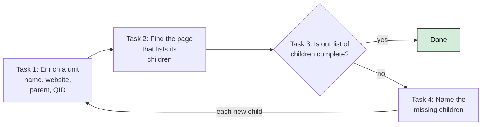

# Background and design decisions

Where this project came from, and the decisions we made early that still hold. This file
replaces two older Google Docs ("Citation Analysis Project" and "Scholar+Wikidata Project:
Notes and Tasks"), which are now deprecated. Everything from them that still matters is here.

## Origins

The project began as a system to compare the Google Scholar profiles of researchers
with peer benchmarks (all faculty, top-20 schools, one discipline). For that, we needed
the department of each researcher. That needed a clean hierarchy of universities,
schools, and departments. Building that hierarchy, in Wikidata so that
everyone can use it, became the project.

The earlier effort collected its hierarchy through paid crowdsourcing. Figures recorded at
the time:

| Item | Value |
|---|---|
| Spend on crowd tasks since 2015 | about $28,500 |
| Organizations collected | about 16,000 |
| Author profiles collected | about 100,000 |
| Amortized cost per entity, all tasks | about 20 cents |

That dataset still exists, in BigQuery:

```
nyu-datasets.academiabot.organization
```

The project's service account has read access to it. See "BigQuery access" in AGENTS.md
for how to query it from a Claude Code session (use the Python client, not the bq tool).

**What is in it.** One table of about 16,000 organizations. Each row has an integer id,
a name, a parent id, a location, and a website. It also has the URL of the page that
listed its children or faculty. 15 rows also have a Google Scholar organization id. The
hierarchy is up to five levels deep:

| Depth | Rows | Typically |
|---|---|---|
| 0 | 170 | universities |
| 1 | 1,189 | schools and colleges |
| 2 | 6,982 | departments |
| 3 | 5,380 | divisions, centers, programs |
| 4 | 1,990 | sub-units of those |

**What NYU looks like in it.** NYU (id 32) has 24 children. Real schools among them
are Stern, Courant, Steinhardt, Tisch, Law, Tandon, Wagner, Dentistry, Nursing, Medicine,
Arts and Sciences, and the School of Professional Studies. Other rows are administrative
offices, not academic units: Office of the Provost, President, University Life, and
Libraries. Other rows are abbreviations: TSOA for Tisch, IFA, ISAW, and Silver SSW. Stern has 9 children, of which
7 are departments, 1 is a program, and 1 is a duplicate row for the school itself.
Courant has only 3 children. Steinhardt has 11, which looks close to complete.

**How to use it.** It is a good starting list for the departments of a school. It also
helps to find the page that lists the faculty: the column with the source URL of the
children holds mostly faculty pages. It is not a ground truth, for four reasons:

- Crowd workers collected it over several years, starting in 2015.
- It mixes administrative units and academic units.
- Names are sometimes abbreviations.
- Most website URLs are plain http, and the pages may have moved.

Treat every row as a candidate. A person must confirm it against the current website of
the school.

## The human task design we started from

The crowdsourcing design broke the work into four small human tasks. The LLM pipeline
now does most of this work. But the four tasks are still a good model for the human
review step (TASKS.md, Shuo's weeks 7 to 9). Each task has a clear answer.



1. **Enrich an entity.** Given a unit, record its name, location, website, parent, and
   identifiers (Wikidata QID, Google Scholar organization ID).
2. **Find the children page.** Given a unit, provide the URL that lists its sub-units
   (a university's schools page, a school's departments page), or mark that it has none.
   If it has none, provide the URL of its faculty list instead.
3. **Check completeness.** Show the list of children we have and the URL from task 2.
   Is the list complete? Yes or no.
4. **Add the missing children.** If no, name the missing ones. Each new name goes back to
   task 1 with the correct parent.

The review sheet keeps the same tasks. The "source URL" column is task 2. The verdict
column is task 3. A "fix" verdict with a corrected value is task 4.

## Decisions that still hold

**No fact enters Wikidata without a written source that a person has checked.** The
LLMs must cite a URL for every unit they propose. The code will check that the page
exists and names the unit (TASKS.md, Shuo's week 5). A reviewer confirms each unit
before export. The reference goes into Wikidata with the statement (reference URL and
date retrieved). Wikidata editors revert bulk additions that have no references.

**P749 (parent organization) is the primary link, not P361 (part of).** The earliest
notes used P361 because it reads naturally ("Harvard College is part of Harvard"). We
changed to P749 for three reasons:

- It is the recommended inverse of P355 (has subsidiary).
- Wikidata uses it in its own model of organizations.
- One SPARQL query path then follows the whole chain: `?dept wdt:P749+ ?univ`.

P361 can be added as a second, supplementary statement. A joint unit gets a second P749
with normal rank and qualifiers.

**Minimum statement set for a new item.** Label, English description, P31 (instance of),
P749 (parent), P17 (country), and P856 (website) if known. Universities also get P1771
(IPEDS ID). Nothing less, so that every item we create is identifiable and attached.

**One QuickStatements file per hierarchy level.** Schools go in one batch, departments
in another. If we must undo a batch, the damage stays in one level.

**Pilot before scale.** Run the full loop on a small set of different universities
before any large batch. We did this for 12 universities at the school level; see
`wikidata_discover/eval/`.

**Faculty come last.** Researcher-to-department links (P108 employer, P39 position held)
are uploaded only after the department hierarchy is stable.

## Reference sources and identifiers

Sources worth knowing about when building ground truth or reconciling:

- **IPEDS** (NCES): every accredited U.S. institution with a unit ID. Wikidata property P1771.
- **ROR** (Research Organization Registry, ror.org): open registry of research organizations,
  successor to GRID. Wikidata property P6782. It helps for institutions outside the U.S.
  and for a small number of schools.
- **Accreditation bodies** (AACSB for business, ABET for engineering, LCME for medicine):
  official lists of accredited schools and programs. Use them to confirm names.
- **Wikidata EntitySchemas** E44 and E45 describe how universities and their parts are
  expected to be modeled. Check them before proposing new statement patterns.
- **Researcher identifiers** to collect when faculty linking begins: ORCID (P496), Google
  Scholar author ID (P1960), DBLP (P2456), and where relevant SSRN and PubMed author IDs.

## Community

Before any large upload, post the data model and a sample batch on the WikiProject
Universities talk page. Ask for review. Wikidata editors revert what they do not
understand, and early goodwill costs little.
